

<button class="language-toggle" onclick="toggleLanguage()" aria-label="Toggle language">
  🇩🇪 German
  🇬🇧 English
</button>

<!-- ENGLISH VERSION -->
{::options parse_block_html="true" /}

# 1. First Steps
{: .lang-en}

## 1.1 Login to IBM Cloud Portal

The first step to working with IBM Cloud is logging into the IBM Cloud Portal.

1. Open the login page: [IBM Cloud Login](https://cloud.ibm.com/login)
2. Enter your credentials (username and password)
3. Confirm the login to gain access to the IBM Cloud Dashboard

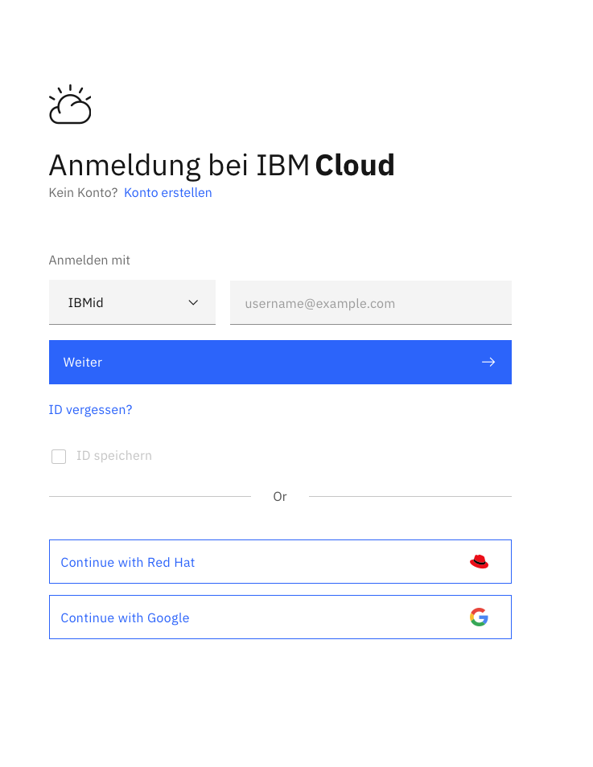

---

## 1.2 Enable Multi-Factor Authentication (MFA)

After logging into the IBM Cloud Account, the first step should be to enable Multi-Factor Authentication (MFA).

**Why MFA?**

A password-only protected account no longer meets current security requirements. MFA is already standard in many areas such as banking or social networks and is also **recommended as a best practice** in IBM Cloud.

**To enable MFA, follow these steps:**

1. Navigate to `Manage` in the top bar and select the `Access (IAM)` submenu
2. In the left sidebar, click on `Settings`
3. Under `Settings`, switch to `Authentication`

**Here you can now select how MFA should be set up. The recommended setting is:**

- **MFA for a user with an IBMid**
- **Either**, enable MFA for federated and non-federated users

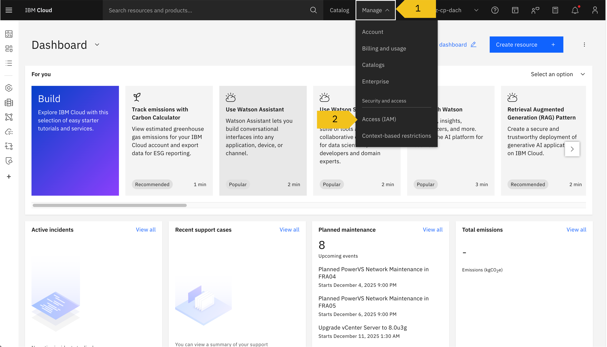

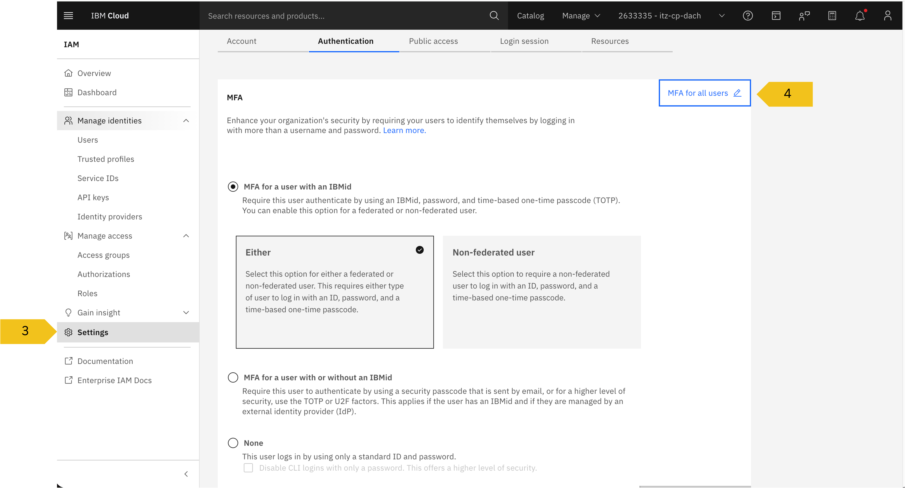

---

## 1.3 Account Settings / Activating a Subscription

To find important information such as the account name or account ID, as well as to redeem subscriptions and manage other settings such as:

- Financial Services Validated
- EU Supported
- HIPAA Supported
- Enterprise-managed IAM
- Commercial Proof of Concept (PoC)
- Virtual Routing and Forwarding
- Service Endpoints

**Proceed as follows:**

1. Navigate to `Manage` in the top bar
2. Select the `Account` submenu
3. Click on `Account Settings` in the sidebar

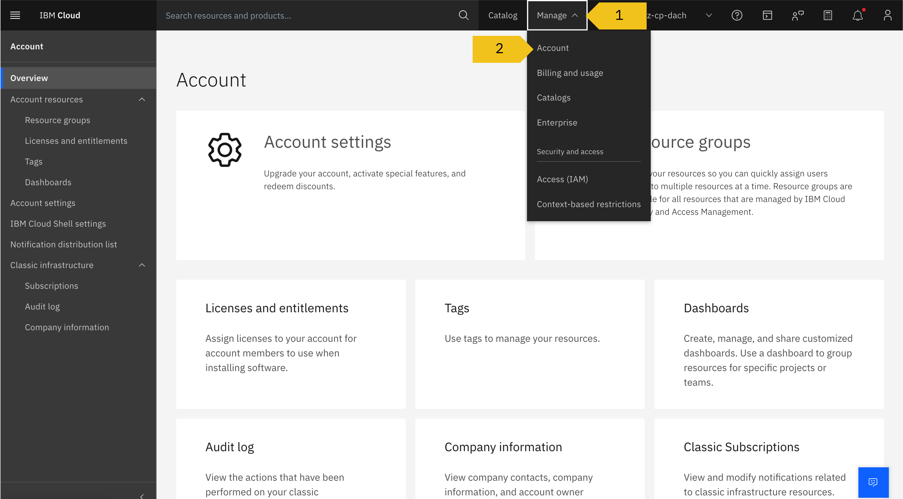

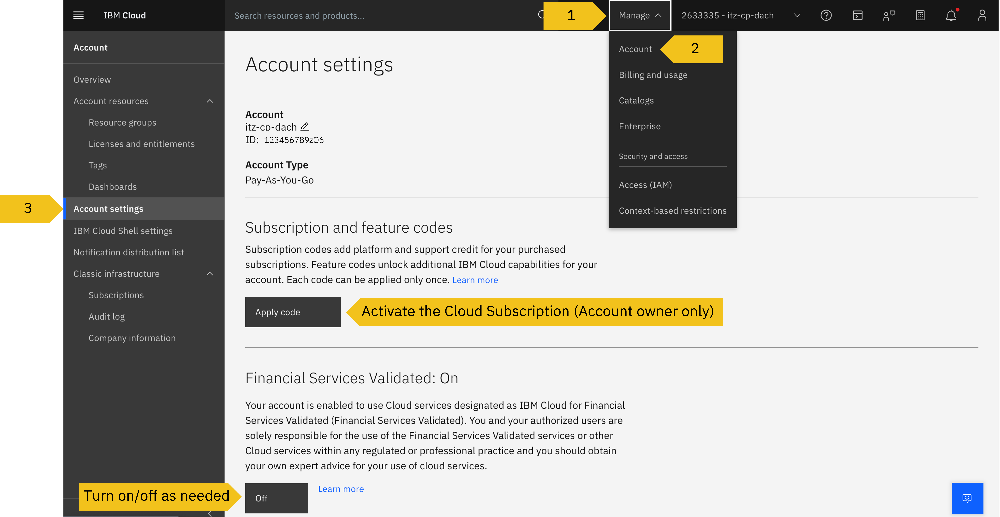

---

# 2. Working with Resource Groups

## 2.1 Resource Groups Explained

Resource groups are **logical containers** that organize related cloud resources (VMs, databases, etc.). They serve as central anchor points to **apply IAM access policies to the entire group**, simplifying permission management. They also enable **clear cost tracking (billing)** and **easy, isolated management** of the entire lifecycle of the contained resources.

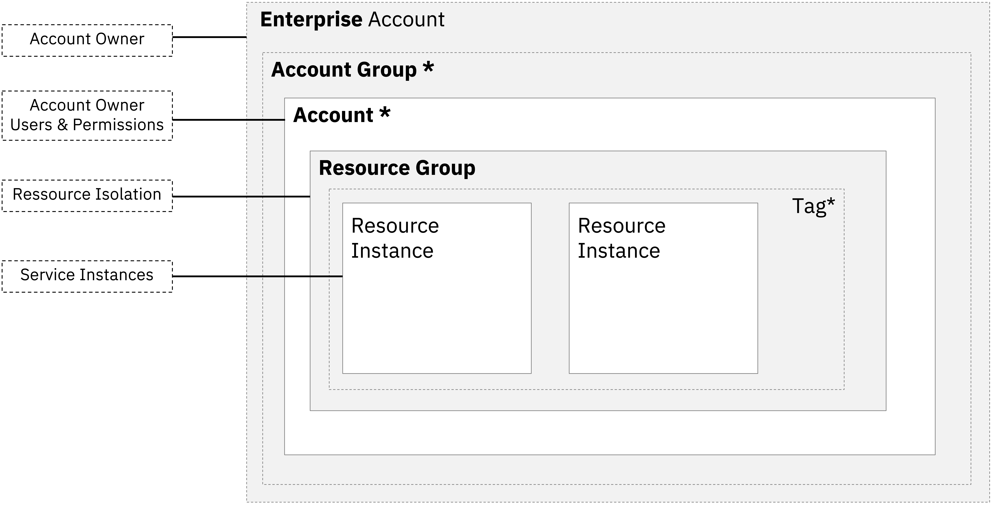

The physical location of the resources is irrelevant for grouping. A resource group can contain resources that have been deployed across different geographic zones and regions.

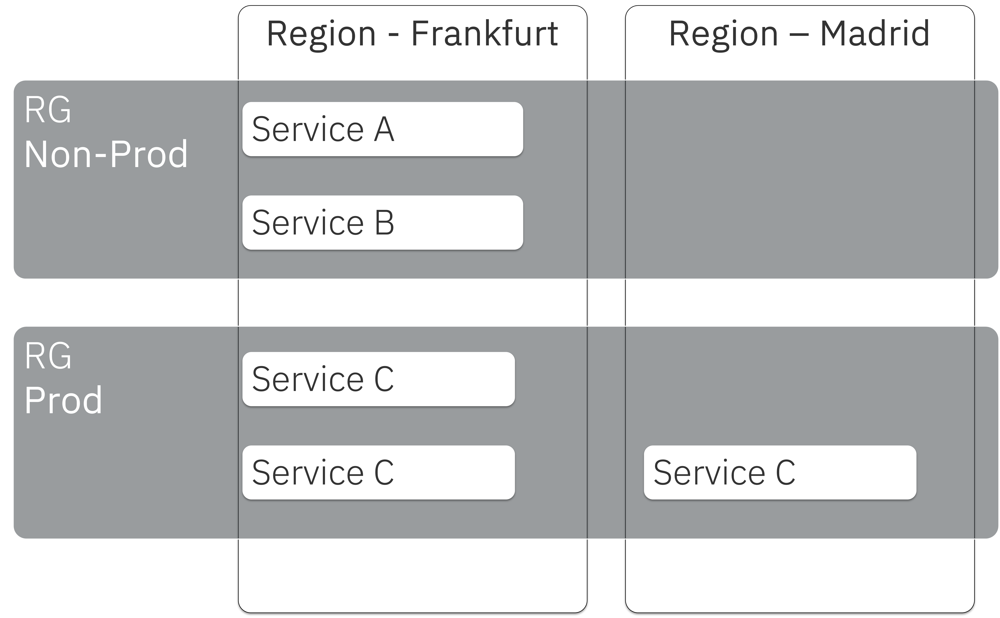

---

## 2.2 Creating Resource Groups

Plan your hierarchy before creating the first resource group. Consider whether organization by environments (Dev/Test), projects, or teams is best suited for your case. Consider how you want to assign permissions, allocate costs, and manage resources within the team.

**A resource group is created as follows:**

1. Navigate to `Manage` in the top bar
2. Select the `Account` submenu
3. Click on `Account resources` in the left sidebar
4. Navigate to the `Resource groups` submenu
5. On the right side, you can now click on `Create +`

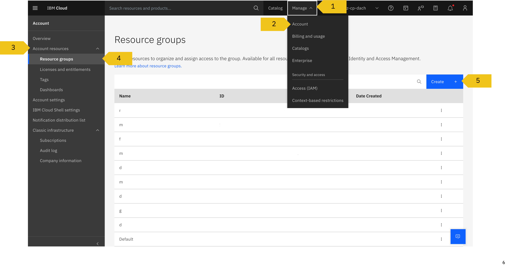

---

# 3. Identity and Access Management (IAM)

## 3.1 IAM Overview

### Identity Management (Manage Identities)

- **Trusted Profiles:** Enable secure, passwordless authentication for compute resources (e.g., clusters, VPCs) or federated users. They eliminate the need to manage long-lived credentials in applications.

- **Service IDs:** Identities for applications, tools, and automated processes. Since they are decoupled from human users, workflows remain stable even when employees change.

- **API Keys:** Credentials for authentication via CLI or API. They can be assigned to either a personal user account or a service ID to perform actions programmatically.

- **Identity Providers:** Enables connection of external corporate directories (e.g., via SAML or OpenID Connect). Users authenticate with their existing corporate credentials (Single Sign-On).

### Access Control (Manage Access)

- **Access Groups:** The most important tool for efficient permission management. IAM policies are assigned to the group once. All members (users, service IDs) automatically inherit these permissions.

- **Authorizations:** Control direct access between IBM Cloud Services (service-to-service), without involving a user identity (e.g., a Kubernetes cluster may access a Container Registry).

- **Roles:** Define the specifically allowed actions. IBM distinguishes between `Platform Roles` (management of COS, e.g., create/delete) and `Service Roles` (usage of COS, e.g., read/write data).

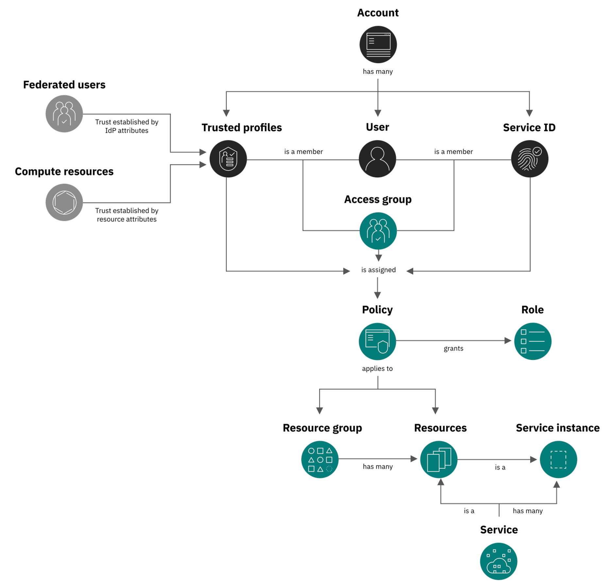

**Accessing IAM Management:**

1. Click on `Manage` in the top navigation bar
2. Select `Access (IAM)` from the dropdown menu

In the left sidebar, you will then find an overview of all available IAM options and settings.

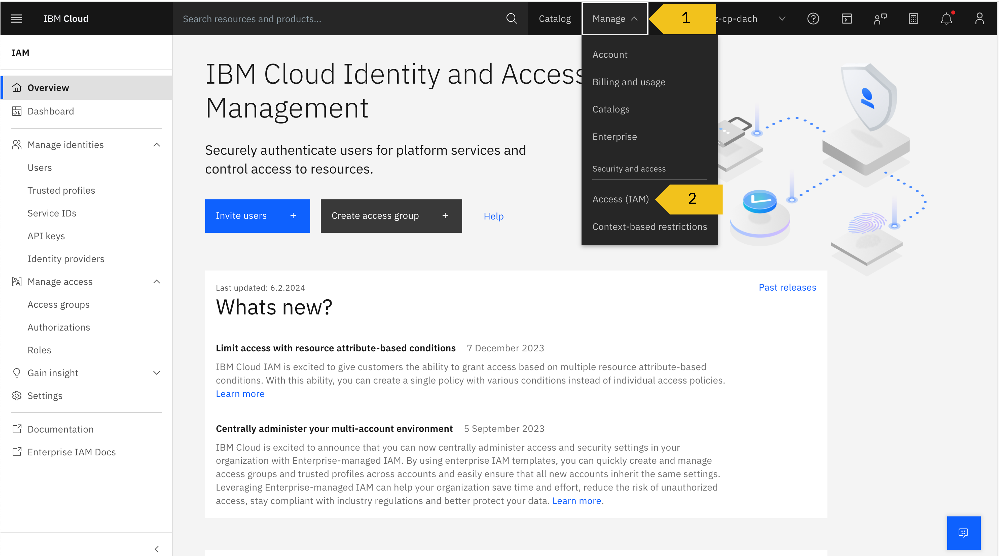

---

## 3.2 Access Policies and Access Groups

**Access Policy:**

An Access Policy is the actual ruleset that defines who (subject) can do what (resource) and how (role). It essentially consists of:

- The target resource (e.g., "All Kubernetes Clusters in Resource Group X")
- The role (e.g., Viewer or Administrator)

**Access Groups:**

An Access Group is a logical container that bundles different identities (users, service IDs, trusted profiles). It serves efficient management: Instead of assigning permissions to each user individually, you simply add the user to a group (e.g., Admins or Dev-Team). They then automatically inherit all rights of this group.

**Best Practice:**

In practice, you create an Access Policy and assign it to an Access Group, which you then assign to users.

Individual policies are difficult to maintain (not scalable). If you assign permissions directly to individual users, you must manually edit each user and remove each policy individually when changes occur (e.g., team changes or employee departure). This is extremely time-consuming and error-prone (security risk due to forgotten permissions).

---

## 3.3 Creating Access Groups (Platform Admin Group)

Creating a Platform Admin Access Group is one of the most important first steps in any new IBM Cloud Account.

**Why do we create it first?**

Initially, only the Account Owner has full administrative rights. This poses a massive risk (Single Point of Failure): If the Owner leaves the company or loses access, the entire account becomes inoperable.

For this reason, we create this group before any other configuration takes place to create redundancy.

**Purpose of the Group:**

This group contains the administrators who technically manage the account (invite users, view billing, control IAM), without having to use the Account Owner login.

**Recommended Permissions:**

This group typically receives the highest rights, such as:

- Administrator role on All Account Management Services (for Billing, Support, User Management)
- Administrator role on All Identity and Access enabled services (to grant rights to other teams)

**Follow these steps to create the group for administrators and equip it with the necessary rights:**

1. Navigate to `Manage` in the top bar of the IBM Cloud Console
2. Select `Access (IAM)` from the dropdown menu
3. Orient yourself in the left sidebar to the `Manage Access` section
4. Click on the `Access groups` submenu there
5. Start creating a new group by clicking the blue `Create +` button
6. Give the group a unique name (e.g., Platform-Admins) and a brief description. Then confirm with `Create`
7. You are now in the overview of the new group. Click on `Access` in the tab bar at the top
8. Click on the blue `Assign access +` button to start the permission assignment process
9. In the first step, select `All Account Management Services` under "Service" (this controls access to Billing, User-Invites, etc.)
10. Scroll to "Roles and actions" and check the `Administrator` role
11. Click the `Add` button at the bottom to note this rule
12. Now create the second policy directly: This time select `All Identity and Access enabled services` as the service (this enables access to all resource instances)
13. Under "Roles and actions", also select the `Administrator` role again
14. Add this second rule as well with a click on `Add`
15. On the right side, you will now see a summary of the noted policies in the Summary section. Review the selection and finalize the process with a click on `Assign`

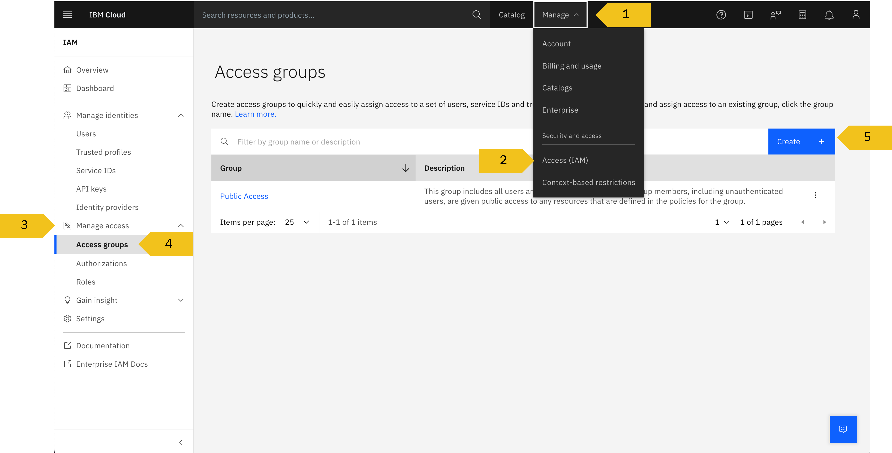

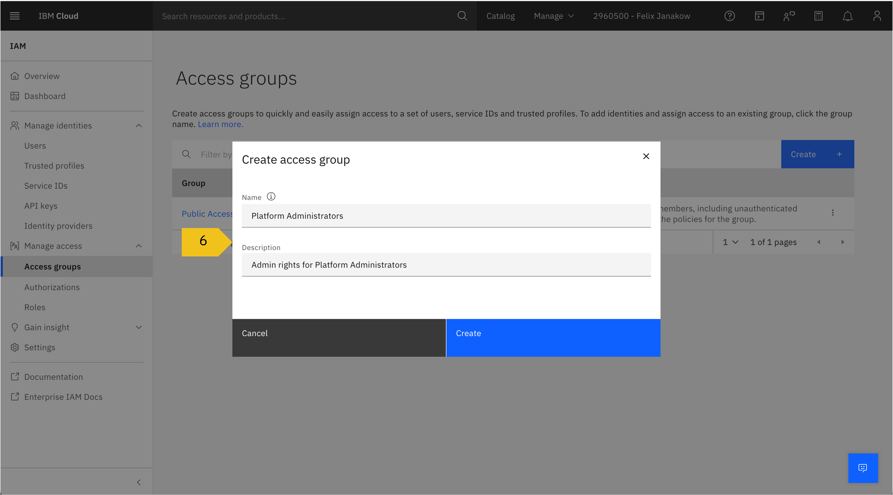

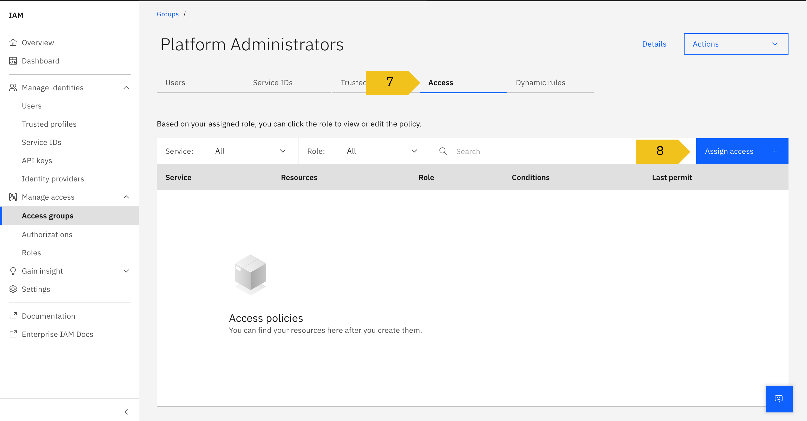

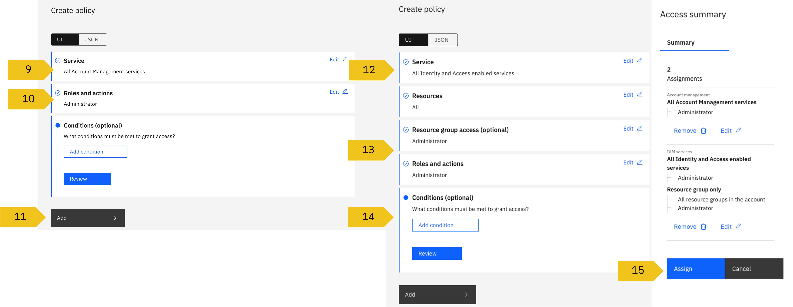

---

## 3.4 Inviting Users (Admins)

To grant new employees or users access to your IBM Cloud account, they must be explicitly invited.

**Follow these steps:**

1. Navigate to `Manage` in the top bar
2. Click on `Access (IAM)`
3. Select `Manage identities` in the left sidebar
4. Select the `Users` option
5. Now click on the blue `Invite users +` button
6. Choose between `Access groups` and `Access policy`
7. Select your Platform Admin `Access group`
8. Finally, click on `Invite` to invite the users

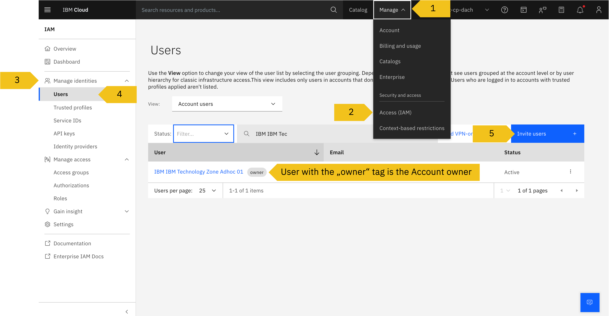

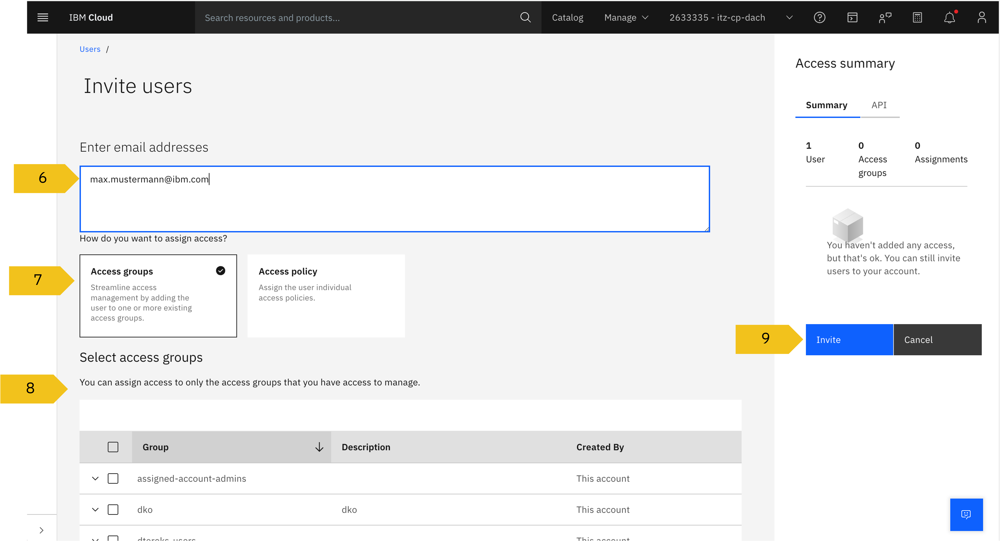

---

## 3.5 Concept: Platform Access vs. Service Access

A common misunderstanding in IAM is the difference between managing the resource itself and using the data contained within it. IBM Cloud strictly separates these permissions.

This can best be explained using the example of Cloud Object Storage (COS):

### 1. Platform Access (Managing the "Shell")

Platform Access refers to actions that take place at the IBM Cloud Console level. It's about controlling the lifecycle of the service, not its content.

**Focus:** Management of the service instance

**Typical Roles:** Viewer, Editor, Administrator

**COS Example:**

- A user with the Editor role can create a new COS service instance or change the instance name
- They can assign the instance to a resource group
- **But:** They cannot (without Service Access) see which files are in the buckets or upload files

### 2. Service Access (Using the "Content")

Service Access refers to actions that take place within the service, mostly via API calls or direct data operations. It's about access to the actual data.

**Focus:** Using the API and data manipulation

**Typical Roles:** Reader, Writer, Manager

**COS Example:**

- A user with the Writer role can upload or delete files (objects) to a bucket
- A user with the Reader role can download files
- **But:** They cannot delete the COS instance itself or invite other users to it

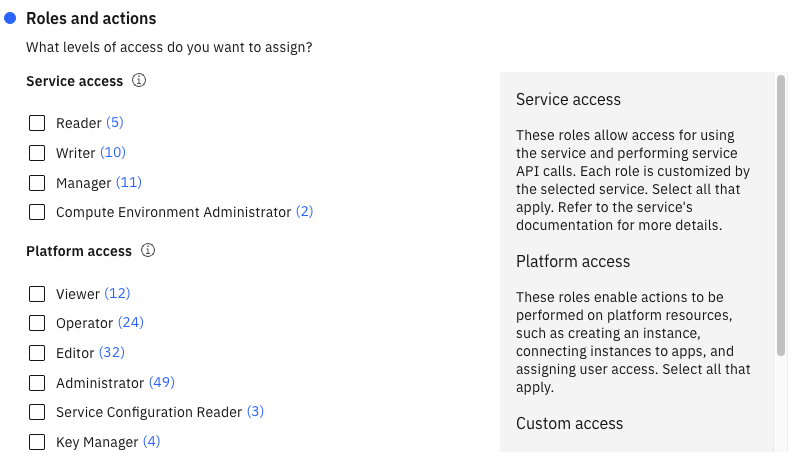

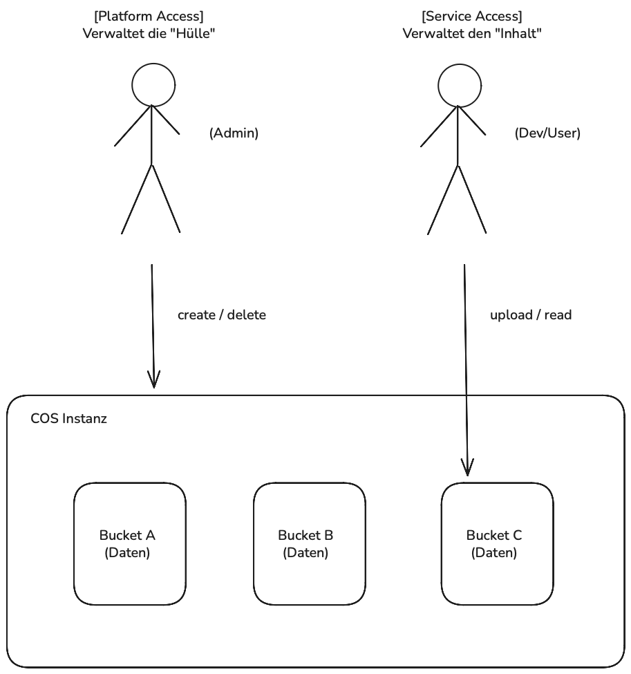

---

## 3.6 Creating Custom Roles

When standard roles (such as Viewer, Editor, Admin) are too imprecise or grant too many rights, Custom Roles come into play. They enable tailored access control according to the Least-Privilege principle (users receive only the minimally necessary rights).

**How it works:**

Instead of adopting a ready-made role package, you select specific service actions from a list and bundle them into a new role.

**Example:**

You want an operator to be able to restart and stop virtual servers, but they should not have permission to delete servers or create new ones.

- **Standard Editor role:** Would be too powerful (can also delete)
- **Custom Role:** You create a role called "VM-Operator" and add only the actions instance.start and instance.stop

**To create a custom role, navigate as follows:**

1. Go to `Manage` in the top bar
2. Select `Access (IAM)`
3. Click on `Roles` in the left sidebar
4. Start the process with a click on `Create +`

In the subsequent menu, define the role's properties. First, assign a meaningful name and description. Then select the target service and add the desired permissions (Actions) granularly. Once you have selected all actions, finalize the creation via the Create button.

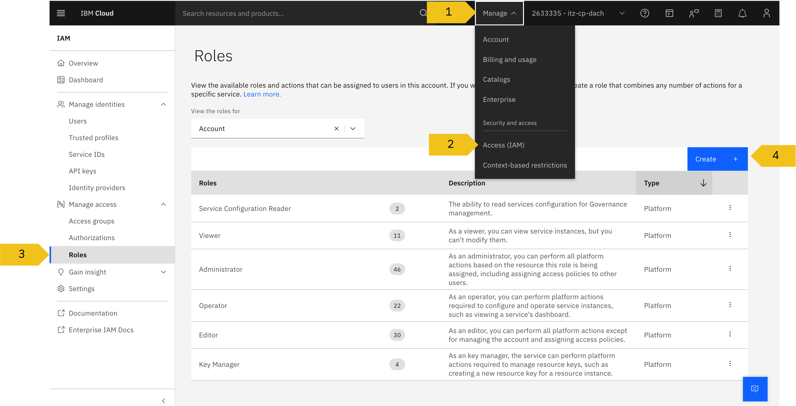

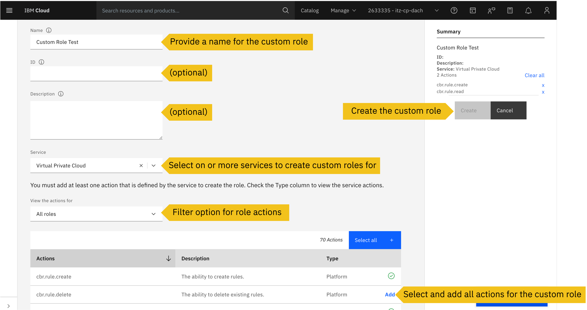

---

## 3.7 Context Based Restrictions (CBR)

Context Based Restrictions (CBR) extend classic IAM with another crucial dimension.

While IAM exclusively controls **who (identity)** may access a resource, CBR additionally defines **from where (network context)** this access must occur. It thus functions as a network-based security layer that is checked after successful authentication.

**The concept is based on two main components:**

### 1. Rules

Here you link a zone with a Cloud Service. A rule states, for example: "Access to Cloud Object Storage Bucket X is only allowed if the request comes from the 'Company-VPN' zone."

**Why is this important?**

Through this additional dimension, CBR effectively protects against Credential Theft. Even if an attacker steals a valid API key (the "Who" is correct), access is denied because they are not coming from the secure corporate network (the "Where" is wrong).

### 2. Network Zones

Here you define trusted origins. A zone is an "allowlist" and can include:

- Specific IP address ranges (e.g., the company VPN)
- Other IBM Cloud VPCs
- Service References (to authorize Cloud Services among themselves)

**To set up Context-Based Restrictions, navigate as follows:**

1. Go to `Manage` in the top bar
2. Select `Context-based restrictions`
3. Then select the desired area: `Rules` or `Network zones`

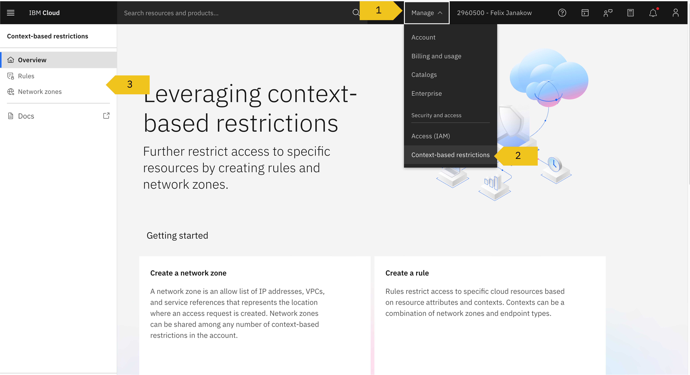

### Network-Based vs. Identity-Based Protection

When does CBR make sense?

A secure cloud architecture uses the "Defense in Depth" principle and combines two fundamental protection layers:

### 1. Network-Based Protection (The Infrastructure Layer)

Here, data traffic is controlled based on **IP addresses, ports, and protocols**. It's about whether a data packet may physically arrive.

- `Security Groups`: A **stateful firewall** that sits directly at the virtual server instance (VSI). It precisely controls which traffic may reach or leave the server.
- `Access Control Lists (ACLs)`: A **stateless filter** at the subnet level. They act as the first barrier and control what may flow into or out of the subnet at all.

### 2. Identity-Based Protection (The Logic Layer)

Here, access is controlled based on **identities and context**. It's about whether a user or service may perform an action (API call), even if they have network access.

- `IAM`: Controls the **"Who" and "What"**. It authenticates the user and checks if they have the necessary rights (roles).
- `Context-Based Restrictions (CBR)`: Links identity with the network. It checks whether the authenticated user is also coming from an allowed network.

**Summary:**

- **Network Protection** prevents unwanted data packets from reaching your servers (e.g., hacker port scans)
- **Identity Protection** prevents authenticated users from performing unauthorized actions or stolen credentials from being used from insecure locations

---

# 4. Working with Resources

## 4.1 Navigating the Catalog

The catalog is the central marketplace and entry point for all services and software solutions in IBM Cloud. It serves to discover, select, and provision resources.

**The content is divided into four main areas:**

- **Services:** IBM-managed services (Managed Services) such as databases, storage, or compute resources
- **Software:** Installable components such as container images, Helm charts, or operators (e.g., for OpenShift), from both IBM and certified third-party providers
- **Deployable Architectures:** Pre-built infrastructure templates (IaC) to set up complex environments securely and compliantly
- **Professional Services:** Consulting and implementation services. Here you find expert support from IBM or partners for specific projects such as migrations, architecture design, or modernization projects

**Additionally:**

**Private Catalog:** Companies can create private catalogs. These serve to provide their own software solutions or approved versions of public services internally for teams and centrally control their access.

**To access the catalog, proceed as follows:**

1. Click on `Catalog` in the top bar
2. Browse through the offering of over 300 products via the search bar or use the various filter options

---

## 4.2 Provisioning Resources from the Catalog

Once you have found the desired service in the catalog, perform the following steps for provisioning:

**Select Service:** Search for the resource name and click on the corresponding tile. You will now reach the service configuration page.

**Obtain Information:** Before creating the resource, you can inform yourself via the tabs in the upper area:

- **About:** Here you will find an overview of features, available plans, and pricing models
- **Docs:** This link takes you directly to the official technical documentation to learn details about setup and usage

**Check Configuration & Price:** Select your desired region and pricing plan. Pay attention to the right sidebar. There you will see a dynamic cost estimate (Cost Summary). Depending on the service and plan, the price can be shown in different intervals (e.g., Hourly for short-term use or Monthly for long-term calculations).

**Create:** Once you have made all settings and agree with the displayed price, complete the process with a click on the `Create` button. The resource will now be provisioned.

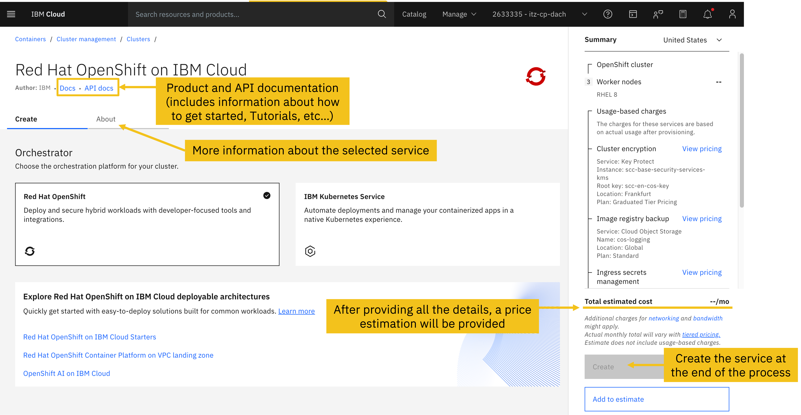

---

## 4.3 Managing / Deleting Resources

To get an overview of provisioned resources/services, navigate as follows:

1. Click on the `Hamburger Menu (Navigation Menu)` in the top left
2. Select the `Resource list` option

In the now displayed overview, you have various options to efficiently organize your resources:

- You can **filter the list specifically by name or resource groups** to find specific services faster
- Additionally, you have the **option to edit tags or delete resources directly from the list**
- Clicking on a resource name opens its individual dashboard. There you access the detailed menu to further **configure, edit, or permanently remove the instance**

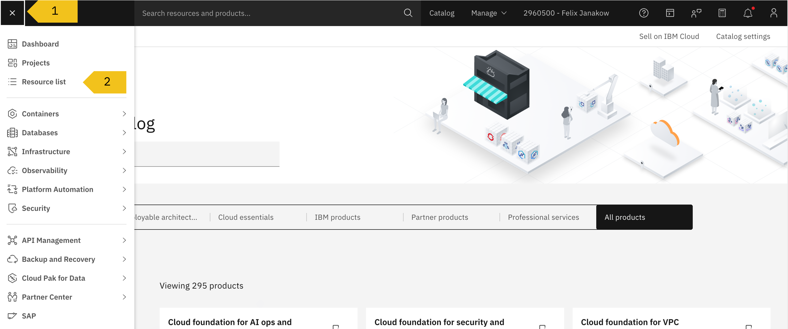

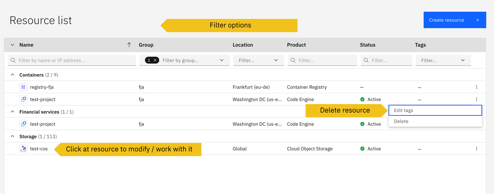

---

# 5. Billing and Usage

## 5.1 Billing and Usage Overview

The central entry point for cost management is the Overview page. It provides a projected summary of your account's current financial status without immediately diving into complex data tables.

**Key metrics at a glance:**

- **Usage summary:** Shows the costs of past months, the estimated total costs for the current month to date, and a cost forecast for the coming month
- **Recent Invoices:** A list of invoices from recent months including amount and payment status
- **Billing Period:** Indicates the start and end date of the current billing cycle
- **Commitments & Subscriptions:** An overview of contractual minimum commitments, subscriptions, or available credit
- **Spending notifications:** Shows the status of your configured alerts (e.g., whether budget limits are almost reached)

**Navigation to Billing and Usage:**

1. Click on `Manage` in the top bar
2. Select `Billing and usage`
3. You land by default directly on the `Overview` tab

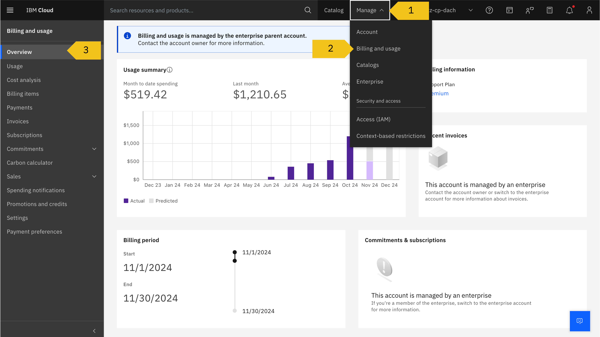

---

## 5.2 Usage

The Usage area is your primary tool for validating the monthly invoice. It allows you to precisely break down costs to resource groups and trace them down to individual technical metrics.

**Navigation:** Select the `Usage` option in the left menu under `Billing and usage`

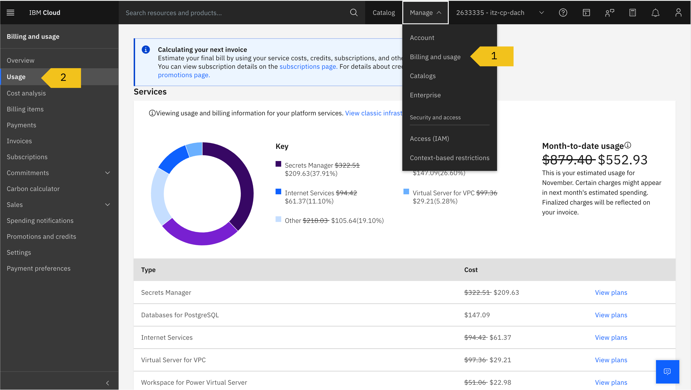

### The Analysis Workflow (Drill-down)

Proceed as follows to check cost generation in detail:

**Select Time Period and Grouping:**

Select the desired month in the top right. Then change the view at "Group by" to the desired Resource Group.

**Result:** You immediately see what costs the selected resource group incurred in this month.

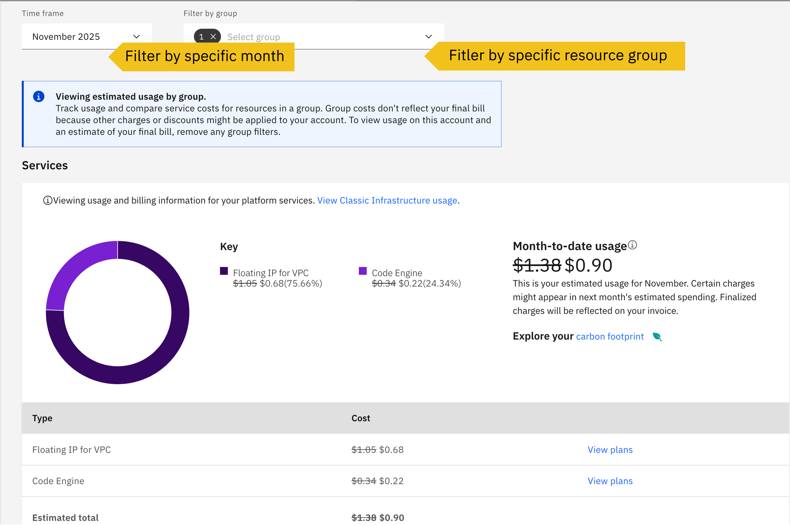

**Check Usage by Service, Plan, and Region:**

Click on `View plans` to view the usage of a service (You can also directly select a service in the `Usage` start view and go to `View plans`).

**Result:** You see at a glance the used plan (e.g., Standard or Enterprise) and the region (e.g., Frankfurt) where the costs were incurred. You can also apply the filter here to a specific month and resource group.

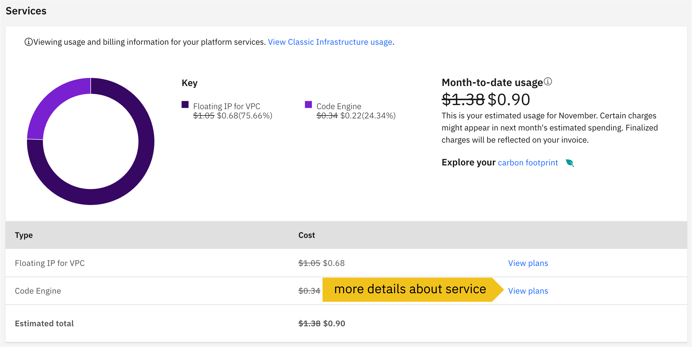

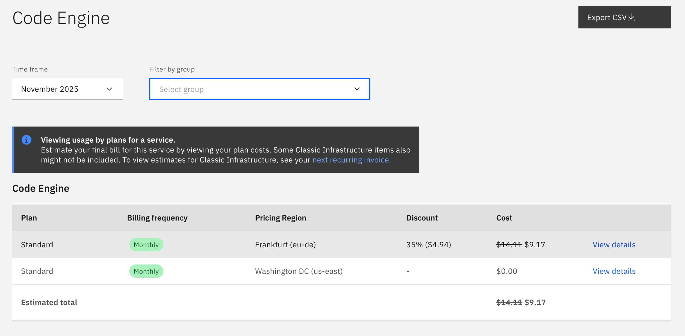

**Analyze Consumption Units:**

Click on `View details` for a service.

**Result:** Here you see the complete breakdown of billing metrics for this service. You can see exactly what was charged, e.g.:

- GIGABYTE_HOURS (How much storage was occupied for how long?)
- MILLION_API_CALLS (How often was the service accessed?)
- IP_HOURS (Costs for reserved IPs)

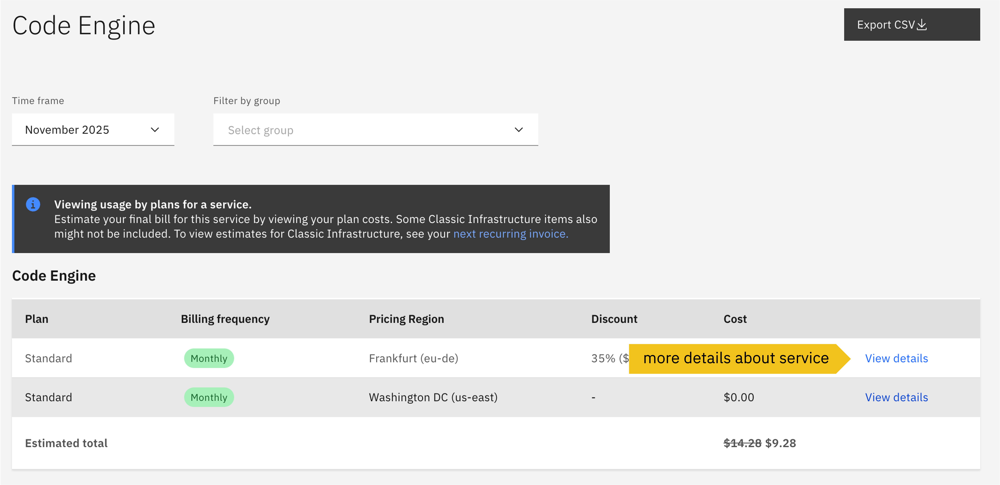

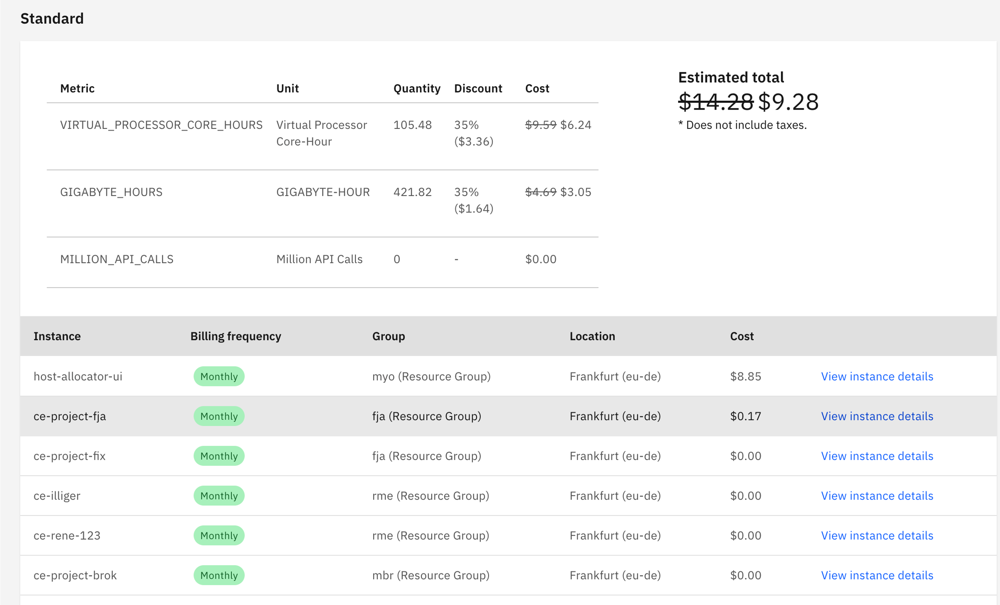

**Deep Analysis at Instance Level:**

To know exactly which specific instance (resource group) is responsible for which costs and how exactly the costs are broken down, click on `View instance details`.

**Result:** You drill down one more level. Now you see each individual instance (resource group) and its individual contribution to the total costs.

**Summary:** In the Usage area, you move from "big to small": From the resource group via the service plan to the technical metrics and finally to the individual instance.

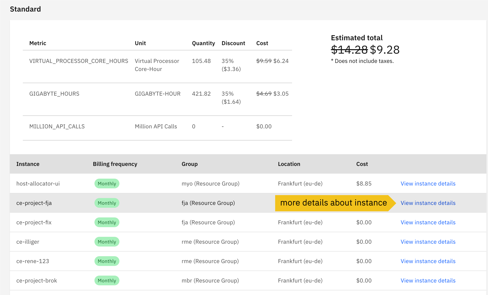

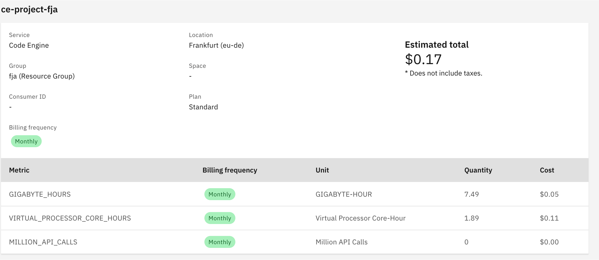

**Tip:** You can export the expenses of all levels as CSV by clicking on `Export CSV` in the upper right field.

---

## 5.3 Cost Analysis

Cost Analysis serves to strategically examine your expenses. It provides you with powerful tools to not only see totals, but to isolate cost drivers through precise filtering and visualize them.

**Navigation:** Select the `Cost analysis` option in the left menu under Billing and usage

### Functions and Filters

To tailor the cost analysis precisely to your question, the sidebar offers a variety of filters. You can restrict the display by the following categories, among others:

- `Region`
- `Service`
- `Plan`
- `Instance & Instance ID`
- `Resource group`
- `Category`
- `Tags`
- ...and other specific criteria

**Time frame:** Via the Time frame dropdown menu, you determine the observation period (e.g., 3 months, 6 months) to compare developments over a longer period.

**Group by:** At the top, you can specify via Group by how the data should be summarized in the chart (e.g., costs grouped by resource group or service) to immediately capture trends visually.

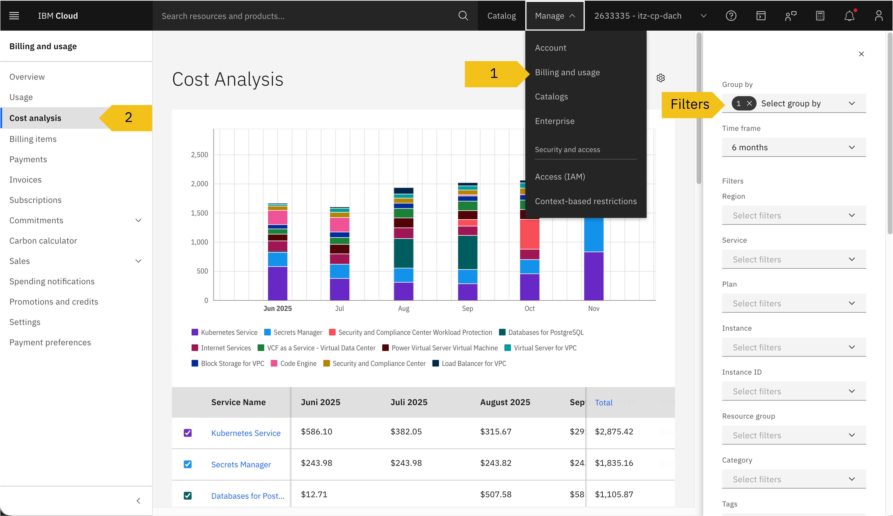

**Difference from Usage:**

The crucial difference lies in the time reference and visualization.

While the Usage area provides you with a static, tabular billing for a single month (focus: invoice verification), Cost Analysis visualizes the development over several months (focus: trend detection). You use **Usage** to see exactly **"what" was charged**, and **Cost Analysis** to understand **"how" costs are developing**.

---

## 5.4 Spending Notifications

So you don't have to actively check the dashboard daily, IBM Cloud offers Spending Notifications. These are automatic alerts that inform you via email as soon as your expenses reach a defined threshold.

**How to create a notification:**

1. Navigate to `Manage` > `Billing and usage`
2. Select the `Spending notifications` option in the left menu
3. Click on the `Create` button

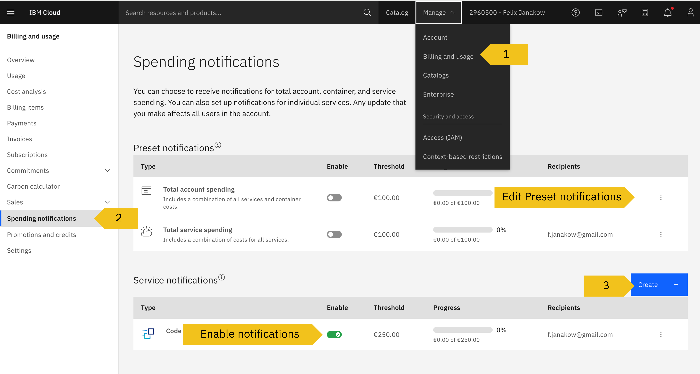

### Configuring the Alert

- **Service:** Decide for which service the notification should apply
- **Recipients:** Enter the email addresses of the people who should be notified (e.g., the Account Owner or project manager)
- **Threshold:** Set a monetary amount (e.g., 500 USD). You can then set at what percentage of this amount to be warned (e.g., notification at 80%, 90%, and 100% of the budget)

Finally confirm the setup with a click on `Create`.

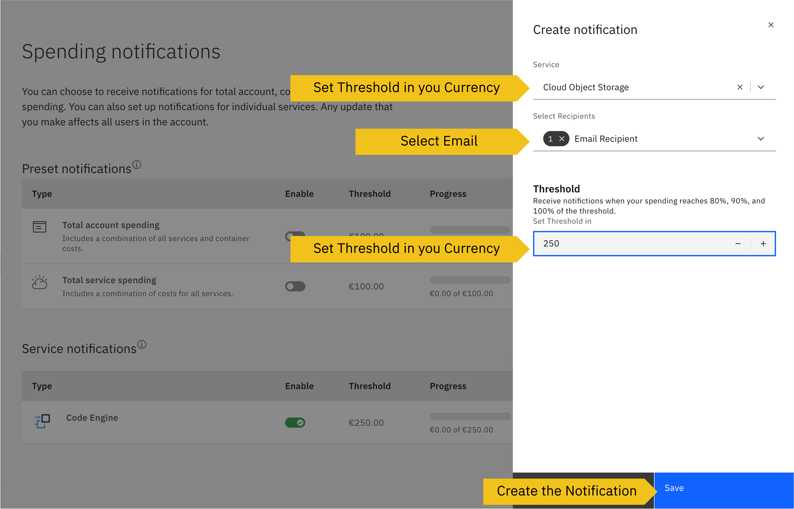

---

# 6. Enterprise Accounts

## 6.1 Enterprise Account Basics

An Enterprise Account is an **administrative hierarchy** that enables large organizations to consolidate multiple IBM Cloud Accounts under one central umbrella. This significantly simplifies management, billing, and governance.

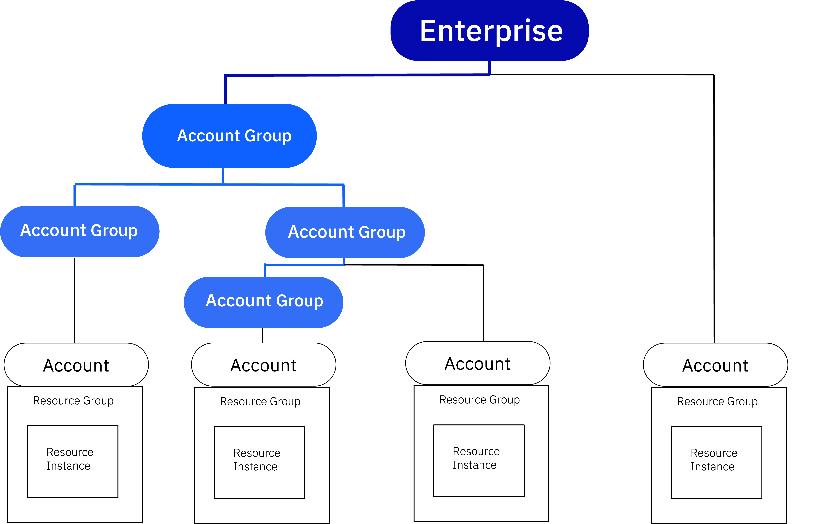

### The advantages and functions are divided into three main areas:

### Centralized Billing & Cost Management

The Enterprise Account acts as the central payment point for all subordinate accounts.

**Consolidated Invoice:** Instead of many individual invoices, you receive a single, consolidated invoice for the entire company.

**Credit Pooling:** Subscription Credits (credit) are collected at the Enterprise level in a common pool. All accounts in the hierarchy draw from this pool to cover their "Entitlements". This prevents credit from expiring in one account while another account has to pay extra.

**Downstream visibility:** Although the invoice is paid centrally, the system offers full transparency about the consumption of individual accounts. The company can thus precisely determine which department or project caused which costs and charge them internally.

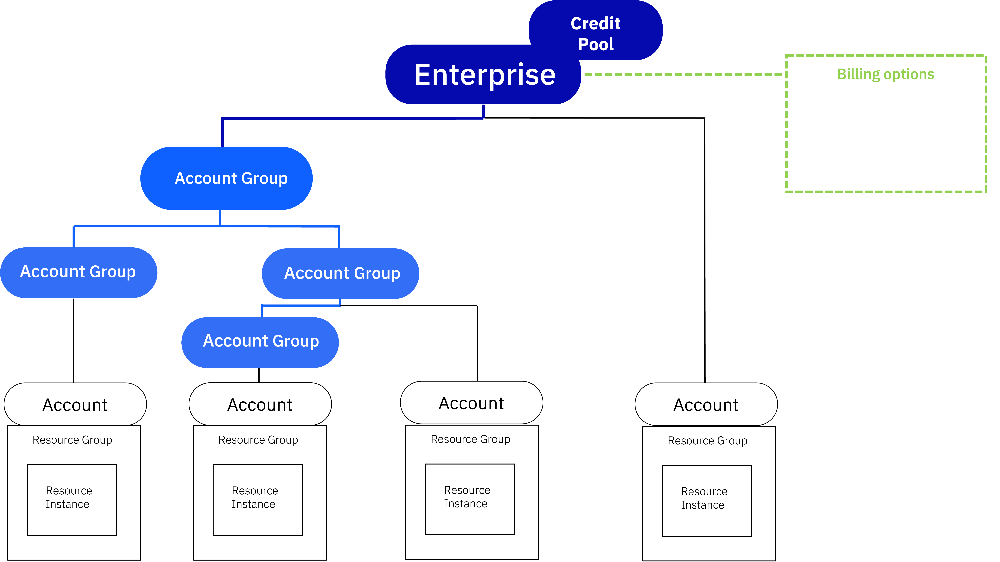

### Flexible Account Hierarchy

You can map your company's structure exactly in the cloud.

**Account Integration:** You have the flexibility to create completely new accounts at any time or subsequently import existing accounts into the Enterprise hierarchy.

**Resource Usage:** It's important to understand that the actual resources (servers, databases) continue to be consumed and operated at the account level. ***The Enterprise Account only serves management purposes.***

**Unified Support:** The support level (e.g., Premium or Advanced) is set centrally and automatically applies to every account within the hierarchy.

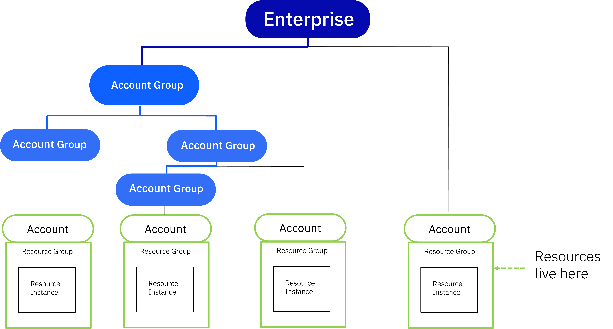

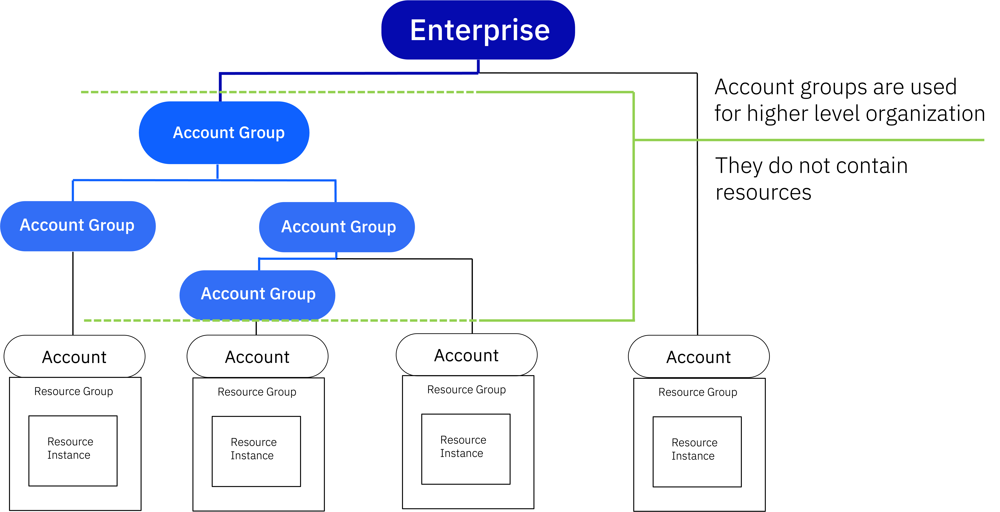

### Governance and Security

The Enterprise Account provides a central control level for policies.

**Central Policies:** You can define governance rules and access policies (IAM) centrally and inherit them downward. This ensures that security standards are maintained company-wide without having to configure each account individually.

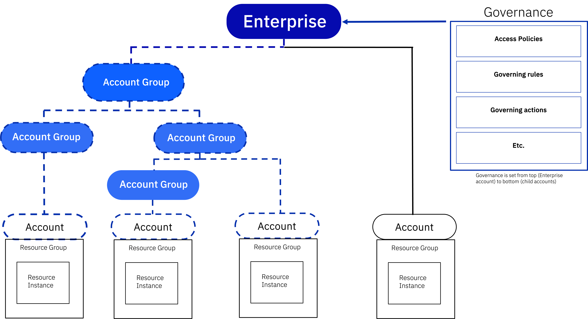

---

## 6.2 Enterprise Account Example Architectures

### Automotive Manufacturer

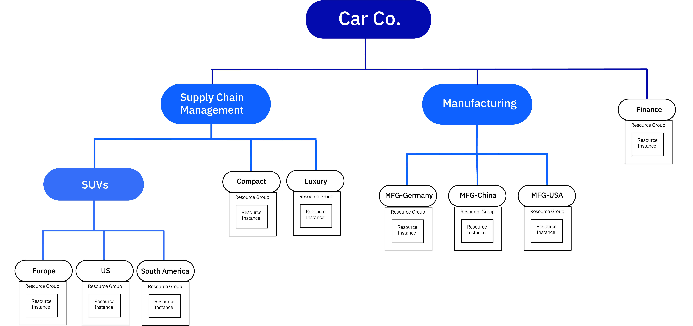

### Business Partner with End Customers

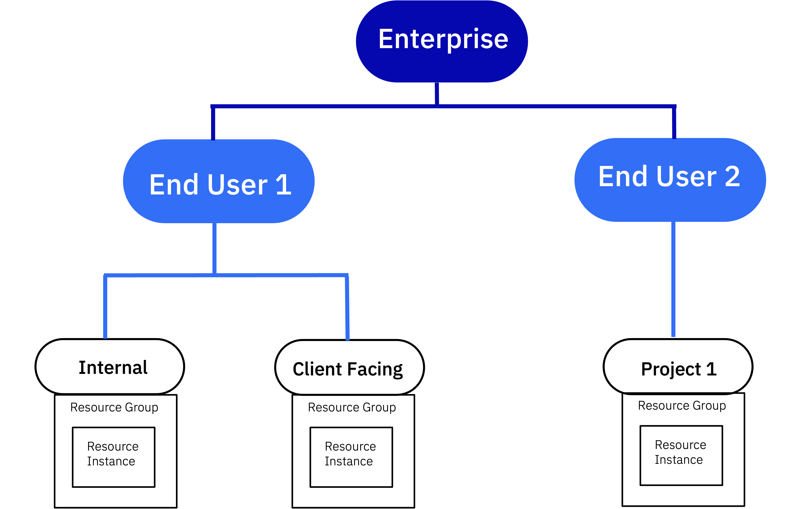

---

# 7. Additional Information

## 7.1 Support Center

The Support Center is your central point of contact for all technical inquiries, problem reports, and assistance regarding the IBM Cloud Platform and its services.

**Navigation:** Click on `Help` in the top navigation bar and then the `Support center` menu item

### The most important functions:

- **Case Management (Tickets):** Here you can create new support cases ("Cases") when you encounter technical problems. The processing time depends on the severity and your support plan

- **FAQs & Documentation:** Before opening a ticket, you can use the integrated search to research known solutions and best practices in the knowledge base

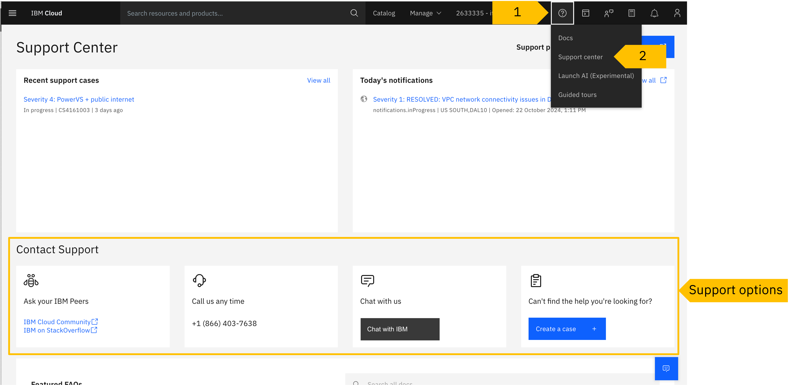

---

## 7.2 Importance of Notifications

In a dynamic cloud environment, regularly checking notifications ***(bell icon in the top right)*** is not an optional task, but an operational necessity.

Ignoring these messages can have serious consequences for the stability of your applications.

**IBM Cloud uses this channel for critical information:**

### Deprecations

Cloud services and runtimes are constantly evolving. When a specific database version or software component reaches its "End of Life", you are warned here in advance. If you overlook this warning, your application may stop working or can no longer be deployed from one day to the next.

### Planned Maintenance

You receive information about upcoming updates to the physical infrastructure or services. This gives you time to check high-availability mechanisms or schedule maintenance windows.

### Required Actions

Often security updates require an active action on your part (e.g., "Restart the cluster to apply the security patch").

**Recommendation:** Regularly check the Notification Center for messages in the High or Critical categories to avoid unplanned outages.

---

## 7.3 Cost Estimations

The Cost Estimator is a planning tool that helps you calculate the expected costs of your cloud infrastructure before provisioning resources.

**Navigation:** Click on `Cost estimator` in the top navigation bar

### Key Features:

- **Service Selection:** Choose from the full catalog of IBM Cloud services
- **Configuration:** Specify the exact configuration (instance type, storage, bandwidth, etc.)
- **Cost Calculation:** Get detailed monthly cost estimates
- **Comparison:** Compare different configurations and pricing plans
- **Export:** Save and share your estimates with stakeholders

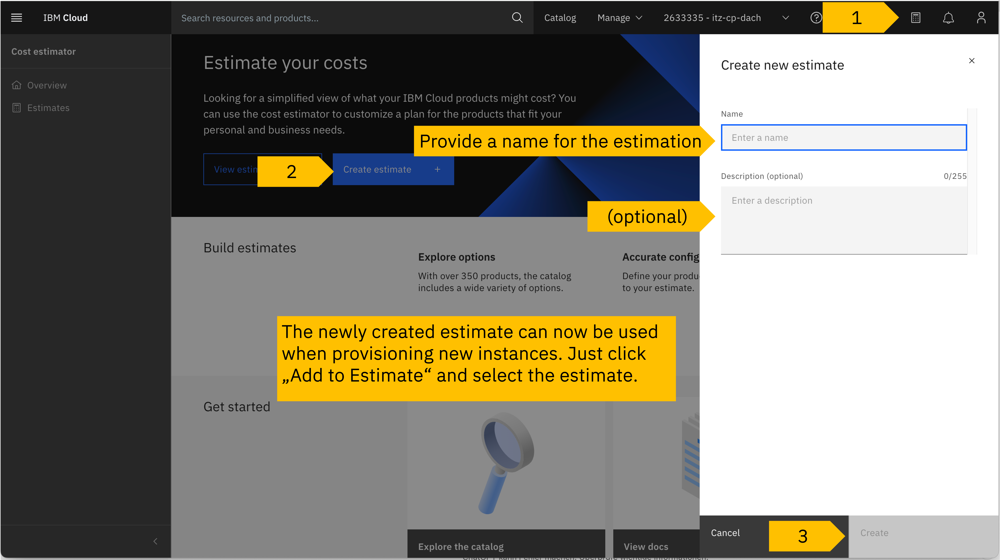

---

## 7.4 Documentation

IBM Cloud provides comprehensive documentation for all services and features.

**Navigation:** Click on `Docs` in the top navigation bar

### What you'll find:

- **Getting Started Guides:** Step-by-step tutorials for beginners
- **API References:** Complete API documentation for developers
- **Best Practices:** Recommended approaches for common scenarios
- **Troubleshooting:** Solutions to common problems
- **Release Notes:** Information about new features and updates

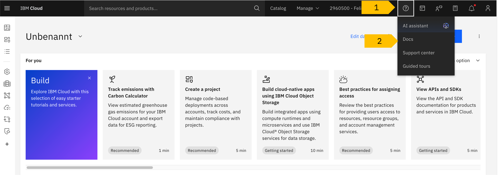

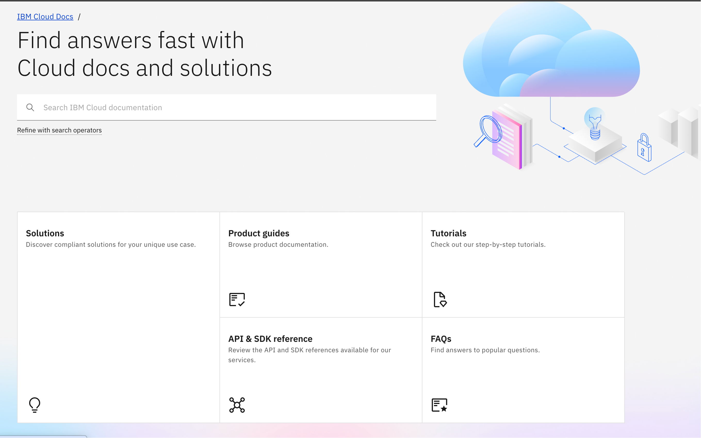

---

# 8. Best Practices

| Type | Description |
| :--- | :--- |
| Account Owner | Use the Owner login only in emergencies. Create a Platform Admin Group for daily management |
| IAM / Access | Avoid individual policies. Consistently use Access Groups to manage permissions centrally and scalably |
| Resources | Strictly separate projects and environments (Dev/Test/Prod) through dedicated Resource Groups for clean billing and IAM |
| Costs | Mandatory setup of Spending Notifications to receive immediate email alerts when budget thresholds are exceeded |
| Security | Use Context Based Restrictions (CBR) to limit access not only by user but also to secure networks |
| Operations | Subscribe to email alerts in the Notification Center for incidents and maintenance work |
| Support | Respond promptly to inquiries. Tickets are automatically closed after 7 days of inactivity |
| Documentation | Consult the official Docs as the primary source for guides and troubleshooting before opening tickets |

<!-- GERMAN VERSION -->

# 1. Erste Schritte
{: .lang-de}

## 1.1 Login im IBM Cloud Portal

Der erste Schritt um mit der IBM Cloud zu arbeiten ist die Anmeldung im IBM Cloud Portal

1. Öffnen Sie die Login-Seite: [IBM Cloud Login](https://cloud.ibm.com/login)
2. Geben Sie ihre Zugangsdaten (Benutzername und Passwort) ein
3. Bestätigen Sie die Anmeldung, um Zugriff auf das IBM Cloud Dashboard zu erhalten

## 1.2 Multi-Faktor-Authentisierung (MFA) aktivieren

Nach der Anmeldung im IBM Cloud Account sollte der erste Schritt die Aktivierung der Multi-Faktor-Authentifizierung (MFA) sein.

### Warum MFA?
Ein ausschließlich passwortgeschütztes Konto erfüllt heutzutage nicht mehr die gängigen Sicherheitsanforderungen. MFA ist in vielen Bereichen wie Banking oder sozialen Netzwerken bereits Standard und wird auch in der IBM Cloud **als Best Practice empfohlen**.

### Um MFA zu aktivieren befolgen Sie folgende Schritte:
1. Navigieren Sie in der oberen Leiste zu `Manage` und wählen Sie den Unterpunkt `Access (IAM)`
2. In der linken Seitenleiste klicken Sie auf `Settings`
3. Unter `Settings` wechseln Sie zu `Authentication`

### Hier können Sie nun auswählen, wie die MFA eingerichtet werden soll. Die empfohlene Einstellung ist:
- **MFA for a user with an IBMid**  
- **Either**, MFA für federated und non-federated User aktivieren

## 1.3 Account-Einstellungen / Aktivieren einer Subscription

Um wichtige Informationen wie den Account-Namen oder die Account-ID herauszufinden, sowie um Subscriptions einzulösen und andere Einstellungen wie:

- Financial Services Validated
- EU Supported
- HIPAA Supported
- Enterprise-managed IAM
- Commercial Proof of Concept (PoC)
- Virtual Routing and Forwarding
- Service Endpoints

### zu verwalten, gehen Sie wie folgt vor:
1. Navigieren Sie in der oberen Leiste zu `Manage`
2. Wählen Sie den Unterpunkt `Account`
3. Klicken Sie in der Seitenleiste auf `Account Settings`

# 2. Arbeiten mit Ressourcengruppen

## 2.1 Ressourcengruppen erklärt

Ressourcengruppen sind **logische Container**, die zusammengehörige Cloud-Ressourcen (VMs, Datenbanken etc.) organisieren. Sie dienen als zentrale Ankerpunkte, um **IAM-Zugriffsrichtlinien auf die gesamte Gruppe anzuwenden** und so die Berechtigungsverwaltung zu vereinfachen. Zudem ermöglichen sie eine **klare Kostenverfolgung (Billing)** und die **einfache, isolierte Verwaltung** des gesamten Lebenszyklus der enthaltenen Ressourcen.

Der physische Standort der Ressourcen ist für die Gruppierung dabei irrelevant. Eine Ressourcengruppe kann Ressourcen enthalten, die über verschiedene geografische Zonen und Regionen verteilt bereitgestellt wurden.

## 2.2 Ressourcengruppen anlegen

Planen Sie Ihre Hierarchie, bevor Sie die erste Ressourcengruppe anlegen. Überlegen Sie, ob eine Gliederung nach Umgebungen (Dev/Test), Projekten oder Teams für Ihren Fall am besten geeignet ist. Berücksichtigen Sie dabei, wie Sie Berechtigungen vergeben, Kosten zuordnen und Ressourcen im Team verwalten möchten.

### Eine Ressourcengruppe wird wie folgt angelegt:
1. Navigieren Sie in der oberen Leiste zu `Manage`
2. Wählen Sie den Unterpunkt `Account`
3. Klicken Sie auf der linken Leiste auf `Account resources`
4. Navigieren Sie in den Unterpunkt `Resource groups`
5. Auf der rechten Seite können Sie nun auf `Create +` klicken

# 3. Identity and Access Management (IAM)

## 3.1 IAM-Überblick

### Identitätsverwaltung (Manage Identities)

- **Trusted Profiles:** Ermöglichen eine sichere, passwortlose Authentifizierung für Compute-Ressourcen (z. B. Cluster, VPCs) oder föderierte Nutzer. Sie machen die Verwaltung langlebiger Credentials in Anwendungen überflüssig.

- **Service IDs:** Identitäten für Anwendungen, Tools und automatisierte Prozesse. Da sie von menschlichen Benutzern entkoppelt sind, bleiben Workflows auch bei Mitarbeiterwechseln stabil.

- **API Keys:** Berechtigungsnachweise für die Authentifizierung über CLI oder API. Sie können entweder einem persönlichen Benutzerkonto oder einer Service-ID zugeordnet werden, um Aktionen programmatisch auszuführen.

- **Identity Providers:** Ermöglicht die Anbindung externer Firmenverzeichnisse (z. B. via SAML oder OpenID Connect). Benutzer authentifizieren sich mit ihren bestehenden Unternehmens-Zugangsdaten (Single Sign-On).

### Zugriffssteuerung (Manage Access)

- **Access Groups:** Das wichtigste Instrument für effiziente Rechteverwaltung. IAM-Richtlinien werden einmalig der Gruppe zugewiesen. Alle Mitglieder (Benutzer, Service-IDs) erben diese Berechtigungen automatisch.

- **Authorizations:** Regeln den direkten Zugriff zwischen IBM Cloud Services (Service-zu-Service), ohne dass eine Benutzeridentität involviert ist (z. B. ein Kubernetes-Cluster darf auf eine Container Registry zugreifen).

- **Roles:** Definieren die spezifisch erlaubten Aktionen. IBM unterscheidet dabei zwischen `Plattform-Rollen` (Verwaltung des COS, z. B. Erstellen/Löschen) und `Service-Rollen` (Nutzung des COS , z. B. Daten lesen/schreiben).

### Zugriff auf die IAM-Verwaltung:
1. Klicken Sie in der oberen Navigationsleiste auf `Manage`
2. Wählen Sie im Dropdown-Menü den Punkt `Acess (IAM)`

In der linken Seitenleiste finden Sie anschließend eine Übersicht aller verfügbaren IAM-Optionen und Einstellungen

## 3.2 Access policys und Access groups

### Access Policy (Zugriffsrichtlinie):
Eine Access Policy ist das eigentliche Regelwerk, das definiert, wer (Subjekt) was (Ressource) wie (Rolle) tun darf. Sie besteht im Kern aus:

Der Ziel-Ressource (z. B. "Alle Kubernetes Cluster in Ressourcengruppe X").

Der Rolle (z. B. Viewer oder Administrator).

### Access Groups (Zugriffsgruppen):
Eine Access Group ist ein logischer Container, der verschiedene Identitäten (Benutzer, Service-IDs, Trusted Profiles) bündelt. Sie dient der effizienten Verwaltung: Anstatt Berechtigungen jedem Nutzer einzeln zuzuweisen, fügen Sie den Nutzer einfach einer Gruppe (z. B. Admins oder Dev-Team) hinzu. Er erbt dann automatisch alle Rechte dieser Gruppe.

### Best Practice:
In der Praxis erstellen Sie eine Access Policy und weisen diese einer Access Group zu, die Sie dann User zuweisen. 

Individuelle Policies sind schwer wartbar (nicht skalierbar). Wenn Sie Berechtigungen direkt einzelnen Benutzern zuweisen, müssen Sie bei Änderungen (z. B. Teamwechsel oder Mitarbeiter-Austritt) jeden Benutzer manuell bearbeiten und jede Richtlinie einzeln entfernen. Dies ist extrem zeitaufwendig und fehleranfällig (Sicherheitsrisiko durch vergessene Rechte).

## 3.3 Access groups erstellen (Plattform Admin Gruppe)
Die Erstellung einer Platform Admin Access Group ist einer der wichtigsten ersten Schritte in jedem neuen IBM Cloud Account.

### Warum erstellen wir sie als Erstes?
Initial verfügt nur der Account Owner über volle Verwaltungsrechte. Dies stellt ein massives Risiko dar (Single Point of Failure): Verlässt der Owner z.B das Unternehmen oder verliert den Zugriff, ist der gesamte Account handlungsunfähig.

Aus diesem Grund erstellen wir bevor irgendeine andere Konfiguration stattfindet diese Gruppe, um Redundanz zu schaffen.

### Zweck der Gruppe:
Diese Gruppe beinhaltet die Administratoren, die den Account technisch verwalten (User einladen, Billing einsehen, IAM steuern), ohne dabei den Account Owner Login nutzen zu müssen.

### Empfohlene Berechtigungen:
Diese Gruppe erhält typischerweise die höchsten Rechte, wie z.B.:

- Administrator Rolle auf All Account Management Services (für Billing, Support, User-Management)

- Administrator Rolle auf All Identity and Access enabled services (um anderen Teams Rechte zu geben)

### Befolgen Sie diese Schritte, um die Gruppe für Administratoren anzulegen und mit den notwendigen Rechten auszustatten:
1. Navigieren Sie in der oberen Leiste der IBM Cloud Konsole zum Menüpunkt `Manage`
2. Wählen Sie im Dropdown-Menü den Eintrag `Access (IAM)` aus
3. Orientieren Sie sich in der linken Seitenleiste am Bereich `Manage Access`
4. Klicken Sie dort auf den Unterpunkt `Access groups`
5. Starten Sie die Erstellung einer neuen Gruppe durch Klick auf den blauen Button `Create +`
6. Geben Sie der Gruppe einen eindeutigen Namen (z. B. Platform-Admins) und eine kurze Beschreibung. Bestätigen Sie anschließend mit `Create`
7. Sie befinden sich nun in der Übersicht der neuen Gruppe. Klicken Sie oben in der Reiter-Leiste auf `Access`
8. Klicken Sie auf den blauen Button `Assign access +`, um den Prozess der Rechtevergabe zu starten.
9. Wählen Sie im ersten Schritt unter "Service" die Option `All Account Management Services` aus (dies steuert Zugriff auf Billing, User-Invites etc.)
10. Scrollen Sie zu "Roles and actions" und setzen Sie das Häkchen bei der `Rolle Administrator`
11. Klicken Sie unten auf den Button `Add`, um diese Regel vorzumerken
12. Legen Sie nun direkt die zweite Policy an: Wählen Sie diesmal als Service die Option `All Identity and Access enabled services` (dies ermöglicht Zugriff auf alle Ressourcen-Instanzen)
13. Wählen Sie unter "Roles and actions" auch hier erneut die Rolle `Administrator` aus
14. Fügen Sie diese zweite Regel ebenfalls mit einem Klick auf `Add` hinzu
15. Auf der rechten Seite sehen Sie nun im Bereich Summary eine Zusammenfassung der vorgemerkten Richtlinien. Überprüfen Sie die Auswahl und schließen Sie den Vorgang mit einem Klick auf `Assign` endgültig ab

## 3.4 User einladen (Admins)
Um neuen Mitarbeitern oder Usern Zugriff auf Ihr IBM Cloud Konto zu gewähren, müssen diese explizit eingeladen werden.

Befolgen Sie dazu folgende Schritte:

1. Navigieren Sie in der oberen Leiste zu ``Manage``
2. Klicken Sie auf ``Access (IAM)``
3. Wählen Sie in der linken Leiste  `Manage identities` 
4. Wählen Sie den Punkt `Users` aus
5. Klicken Sie nun auf den blauen Button `Invite users +`
6. Wählen Sie zwischen `Access groups` und `Access policy`
8. Wählen Sie Ihre Platform Admin `Access group` aus
9. Klicken Sie zuletzt auf `Invite` um die User einzuladen

## 3.5 Konzept: Platform Access vs. Service Access

Ein häufiges Missverständnis in IAM ist der Unterschied zwischen der Verwaltung der Ressource selbst und der Nutzung der darin enthaltenen Daten. IBM Cloud trennt diese Berechtigungen strikt.

Am Beispiel von Cloud Object Storage (COS) lässt sich dies am besten erklären:

### 1. Platform Access (Verwaltung der "Hülle"):
Der Platform Access bezieht sich auf Aktionen, die auf der Ebene der IBM Cloud Konsole stattfinden. Es geht darum, den Lebenszyklus des Services zu steuern, nicht dessen Inhalt.

### Fokus:
Management der Service-Instanz

**Typische Rollen:** Viewer, Editor, Administrator

### Beispiel COS:
- Ein Benutzer mit der Rolle Editor kann eine neue COS-Service-Instanz erstellen oder den Namen der Instanz ändern

- Er kann die Instanz einer Ressourcengruppe zuordnen

- **Aber:** Er kann (ohne Service Access) nicht sehen, welche Dateien in den Buckets liegen oder Dateien hochladen

### 2. Service Access (Nutzung des "Inhalts")
Der Service Access bezieht sich auf Aktionen, die innerhalb des Services stattfinden, meistens über API-Aufrufe oder direkte Datenoperationen. Es geht um den Zugriff auf die eigentlichen Daten.

**Fokus:** Nutzung der API und Datenmanipulation

**Typische Rollen:** Reader, Writer, Manager

### Beispiel COS:
- Ein Benutzer mit der Rolle Writer kann Dateien (Objekte) in einen Bucket hochladen oder löschen

- Ein Benutzer mit der Rolle Reader kann Dateien herunterladen

- **Aber:** Er kann die COS-Instanz selbst nicht löschen oder andere Benutzer dazu einladen

## 3.6 Custom Roles erstellen

Wenn die Standardrollen (wie Viewer, Editor, Admin) zu ungenau sind oder zu viele Rechte gewähren, kommen Custom Roles zum Einsatz. Sie ermöglichen eine maßgeschneiderte Zugriffssteuerung nach dem Least-Privilege-Prinzip (Nutzer erhalten nur die minimal nötigen Rechte).

### Wie es funktioniert:
Anstatt ein fertiges Rollen-Paket zu übernehmen, wählen Sie aus einer Liste spezifische Service-Aktionen aus und bündeln diese zu einer neuen Rolle.

### Beispiel:
Sie möchten, dass ein Operator virtuelle Server neu starten und stoppen darf, aber er soll keine Berechtigung haben, Server zu löschen oder neue zu erstellen.

**Standardrolle Editor:** Wäre zu mächtig (darf auch löschen).

**Custom Role:** Sie erstellen eine Rolle namens "VM-Operator" und fügen nur die Aktionen instance.start und instance.stop hinzu.

### Um eine benutzerdefinierte Rolle (Custom Role) zu erstellen, navigieren Sie wie folgt:
1. Gehen Sie in der oberen Leiste auf `Manage`
2. Wählen Sie den Eintrag `Access (IAM)`
3. Klicken Sie in der linken Seitenleiste auf `Roles`
4. Starten Sie den Prozess mit einem Klick auf `Create +`

Im anschließenden Menü definieren Sie die Eigenschaften der Rolle. Vergeben Sie zunächst einen aussagekräftigen Namen und eine Beschreibung. Wählen Sie danach den Ziel-Service aus und fügen Sie die gewünschten Berechtigungen (Actions) granular hinzu. Sobald Sie alle Aktionen ausgewählt haben, bestätigen Sie die Erstellung abschließend über den Button Create.

## 3.7 Context Based Restrictions (CBR)

Context Based Restrictions (CBR) erweitern das klassische IAM um eine weitere entscheidende Dimension.

Während IAM ausschließlich regelt, **wer (Identität)** auf eine Ressource zugreifen darf, definiert CBR zusätzlich, **von wo (Netzwerk-Kontext)** dieser Zugriff erfolgen muss. Es fungiert somit als eine netzwerkbasierte Sicherheitsschicht, die nach der erfolgreichen Authentifizierung geprüft wird.

### Das Konzept basiert auf zwei Hauptkomponenten:
### 1. Rules (Regeln)
Hier verknüpfen Sie eine Zone mit einem Cloud Service. Eine Regel besagt beispielsweise: "Der Zugriff auf den Cloud Object Storage Bucket X ist nur erlaubt, wenn die Anfrage aus der Zone 'Firmen-VPN' kommt."

### Warum ist das wichtig?
Durch diese zusätzliche Dimension schützt CBR effektiv vor Credential Theft. Selbst wenn ein Angreifer einen gültigen API-Key stiehlt (das "Wer" ist korrekt), wird der Zugriff verweigert, da er nicht aus dem sicheren Firmennetzwerk kommt (das "Wo" ist falsch).

**2. 
Network Zones (Netzwerkzonen)**

Hier definieren Sie vertrauenswürdige Ursprungsorte. Eine Zone ist eine "Allowlist" und kann beinhalten:

Spezifische IP-Adressbereiche (z. B. das Firmen-VPN)

Andere IBM Cloud VPCs

Service References (um Cloud-Services untereinander zu autorisieren)

### Um Context-Based Restrictions einzurichten, navigieren Sie wie folgt:
1. Gehen Sie in der oberen Leiste auf `Manage`
2. Wählen Sie den Eintrag `Context-based restrictions`
3. Wählen Sie anschließend den gewünschten Bereich: `Rules` oder `Network zones`

 

 &nbsp;

### Network-Based vs. Identity-Based Protection - wann macht CBR Sinn?

 

 &nbsp;

Eine sichere Cloud-Architektur nutzt das Prinzip "Defense in Depth" und kombiniert zwei grundlegende Schutzebenen:

### 1. Network-Based Protection (Die Infrastruktur-Ebene)
Hier wird der Datenverkehr auf Basis von **IP-Adressen, Ports und Protokollen** gesteuert. Es geht darum, ob ein Datenpaket physisch ankommen darf.

`Security Groups`: Eine **Stateful Firewall**, die direkt an der virtuellen Server-Instanz (VSI) sitzt. Sie regelt exakt, welcher Traffic den Server erreichen oder verlassen darf.

`Access Control Lists (ACLs)`: Ein **Stateless Filter** auf Subnetz-Ebene. Sie fungieren als erste Barriere und steuern, was überhaupt in das Subnetz hinein- oder herausfließen darf.

### 2. Identity-Based Protection (Die Logik-Ebene)
Hier wird der Zugriff auf Basis von **Identitäten und Kontext** gesteuert. Es geht darum, ob ein Benutzer oder Dienst eine Aktion (API-Call) ausführen darf, selbst wenn er netzwerktechnisch Zugriff hätte.

`IAM`: Regelt das **"Wer" und "Was"**. Es authentifiziert den User und prüft, ob er die notwendigen Rechte (Rollen) hat.

`Context-Based Restrictions (CBR)`: Verknüpft die Identität mit dem Netzwerk. Es prüft, ob der authentifizierte User auch aus einem erlaubten Netzwerk kommt.

 &nbsp;

### Zusammenfassung:
- **Network Protection** verhindert, dass unerwünschte Datenpakete Ihre Server erreichen (z. B. Hacker-Portscans). 

- **Identity Protection** verhindert, dass authentifizierte Nutzer unerlaubte Aktionen durchführen oder gestohlene Zugangsdaten von unsicheren Orten genutzt werden.

# 4. Umgang mit Ressourcen

## 4.1 Navigieren im Katalog
Der Katalog ist der zentrale Marktplatz und Einstiegspunkt für alle Dienste und Softwarelösungen in der IBM Cloud. Er dient dazu, Ressourcen zu entdecken, auszuwählen und bereitzustellen (Provisioning).

### Der Inhalt unterteilt sich in vier Hauptbereiche:
**Services:** Von IBM verwaltete Dienste (Managed Services) wie Datenbanken, Storage oder Compute-Ressourcen

**Software:** Installierbare Komponenten wie Container-Images, Helm-Charts oder Operatoren (z. B. für OpenShift), sowohl von IBM als auch von zertifizierten Drittanbietern

**Deployable Architectures:** Vorgefertigte Infrastruktur-Templates (IaC), um komplexe Umgebungen sicher und compliant aufzusetzen

**Professional Services:** Beratungs- und Implementierungsdienstleistungen. Hier finden Sie Expertenunterstützung von IBM oder Partnern für spezifische Vorhaben wie Migrationen, Architektur-Design oder Modernisierungsprojekte

### Zusätzlich:
**Private Catalog:** Unternehmen können private Kataloge erstellen. Diese dienen dazu, eigene Softwarelösungen oder genehmigte Versionen von Public-Services intern für Teams bereitzustellen und deren Zugriff zentral zu steuern

Um zum Katalog zu gelangen, gehen Sie wie folgt vor:

1. Klicken Sie in der oberen Leiste auf Catalog
2. Durchsuchen Sie das Angebot von über 300 Produkten über die Suchleiste oder nutzen Sie die verschiedenen Filtermöglichkeiten

## 4.2 Provisionieren von Ressourcen aus dem Katalog

Sobald Sie den gewünschten Service im Katalog gefunden haben, führen Sie die folgenden Schritte zur Bereitstellung aus:

**Service auswählen:** Suchen Sie nach dem Namen der Ressource und klicken Sie auf die entsprechende Kachel. Sie gelangen nun auf die Konfigurationsseite des Services.

**Informationen einholen:** Bevor Sie die Ressource erstellen, können Sie sich über die Tabs im oberen Bereich informieren:

**About:** Hier finden Sie eine Übersicht der Funktionen, verfügbare Pläne und Preismodelle.

**Docs:** Dieser Link führt Sie direkt zur offiziellen technischen Dokumentation, um Details zur Einrichtung und Nutzung zu erfahren.

**Konfiguration & Preis prüfen:** Wählen Sie Ihre gewünschte Region und den Preisplan aus. Achten Sie dabei auf die rechte Seitenleiste. Dort wird Ihnen dynamisch eine Kostenschätzung (Cost Summary) angezeigt. Je nach Service und Plan kann der Preis in verschiedenen Intervallen ausgewiesen sein (z. B. Hourly für kurzfristige Nutzung oder Monthly für langfristige Kalkulationen).

**Erstellen:** Sobald Sie alle Einstellungen vorgenommen haben und mit dem angezeigten Preis einverstanden sind, schließen Sie den Vorgang mit einem Klick auf den Button `Create` ab. Die Ressource wird nun provisioniert.

## 4.3 Managen / löschen von Ressourcen

Um einen Überblick über provisionierte Ressourcen/Services zu erhalten, navigieren Sie wie folgt:

1. Klicken Sie oben links auf das `Hamburger-Menü (Navigationsmenü)`
2. Wählen Sie den Punkt `Resource list` aus

In der nun angezeigten Übersicht haben Sie diverse Möglichkeiten, Ihre Ressourcen effizient zu organisieren:

- Sie können die Liste gezielt **nach Namen oder Ressourcengruppen filtern**, um spezifische Dienste schneller zu finden. 

- Zudem haben Sie die **Möglichkeit, Tags zu bearbeiten oder Ressourcen direkt aus der Liste heraus zu löschen**. 

- Ein Klick auf den Namen einer Ressource öffnet deren individuelles Dashboard. Dort gelangen Sie in das detaillierte Menü, um die Instanz weiter zu **konfigurieren, zu bearbeiten oder sie endgültig zu entfernen**.

# 5. Billing and Usage 

## 5.1 Billing and Usage Overview

Der zentrale Einstiegspunkt in das Kostenmanagement ist die Overview-Seite. Sie bietet eine hochgerechnete Zusammenfassung des aktuellen finanziellen Status Ihres Accounts, ohne sofort in komplexe Datentabellen einzutauchen.

### Wichtige Kennzahlen auf einen Blick, hier erhalten Sie sofortige Auskunft über:
### Usage summary:
Zeigt die Kosten der vergangenen Monate, die geschätzten Gesamtkosten für den laufenden Monat bis zum jetzigen Zeitpunkt und eine Kostenvorhersage für den kommenden Monat

### Recent Invoices:
Eine Auflistung der Rechnungen der letzten Monate inklusive Betrag und Zahlungsstatus

### Billing Period:
Gibt das Start- und Enddatum des aktuellen Abrechnungszyklus an.

### Commitments & Subscriptions:
Eine Übersicht über vertragliche Mindestabnahmen, Abonnements oder verfügbares Guthaben

### Spending notifications:
Zeigt den Status Ihrer konfigurierten Warnmeldungen an (z. B. ob Budgetgrenzen fast erreicht sind).

Navigation zu Billing and Usage:

1. Klicken Sie in der oberen Leiste auf `Manage`
2. Wählen Sie `Billing and usage`
3. Sie landen standardmäßig direkt auf dem Reiter `Overview`

## 5.2 Usage
Der Bereich Usage ist Ihr primäres Werkzeug, um die monatliche Rechnung zu validieren. Er ermöglicht es Ihnen, Kosten präzise auf Ressourcengruppen herunterzubrechen und bis zur einzelnen technischen Metrik nachzuvollziehen.

**Navigation:** Wählen Sie im linken Menü unter `Billing and usage` den Punkt `Usage`

### Der Analyse-Workflow (Drill-down):
Gehen Sie wie folgt vor, um die Kostenentstehung im Detail zu prüfen:

### Zeitraum und Gruppierung wählen:
Wählen Sie oben rechts den gewünschten Monat. Ändern Sie anschließend die Ansicht bei "Group by" auf die gewünschte Resource Group

### Ergebnis:
Sie sehen sofort, welche Kosten die gewählte Ressourcengruppe in diesem Monat verursacht hat

### Usage nach Service, Plan und Region prüfen:
Klicken Sie auf `View plans`, um die Usage eines Services einzusehen 

(Sie können auch direkt in der `Usage` Startansicht einen Service wählen und auf `View plans` gehen)

### Ergebnis:
Sie sehen auf einen Blick den genutzten Plan (z. B. Standard oder Enterprise) und die Region (z. B. Frankfurt), in der die Kosten angefallen sind. Sie können auch hier den Filter wieder auf einen bestimmten Monat und Resourcengruppe legen

### Verbrauchseinheiten analysieren:
Klicken Sie bei einem Service auf `View details`

### Ergebnis:
Hier sehen Sie die gesamte Aufschlüsselung der Abrechnungsmetriken für diesen Service. Sie erkennen genau, was berechnet wurde, z. B.:

GIGABYTE_HOURS (Wie viel Speicher wurde wie lange belegt?)

MILLION_API_CALLS (Wie oft wurde der Service angesprochen?)

IP_HOURS (Kosten für reservierte IPs).

### Tiefenanalyse auf Instanz-Ebene:
Um genau zu wissen, welche konkrete Instanz(Resourcengruppe) für welche Kosten verantwortlich ist und wie genau die Kosten aufgeschlüsstelt werden, klicken Sie auf `View instance details`

### Ergebnis:
Sie bohren noch eine Ebene tiefer. Jetzt sehen Sie jede einzelne Instanz(Resourcengruppe) und deren individuellen Beitrag zu den Gesamtkosten.

### Zusammenfassung:
Im Bereich Usage bewegen Sie sich vom "Großen ins Kleine": Von der Ressourcengruppe über den Service-Plan hin zu den technischen Metriken und schließlich zur einzelnen Instanz.

**Tipp:** Sie können sich die Ausgaben aller Ebenen als CSV ausgeben lassen indem Sie auf `Export CSV` im rechten oberen Feld klicken.

## 5.3 Cost Analysis

Die Cost Analysis dient dazu, Ihre Ausgaben strategisch zu untersuchen. Sie bietet Ihnen leistungsstarke Werkzeuge, um nicht nur Gesamtsummen zu sehen, sondern die Kostentreiber durch präzise Filterung zu isolieren und visuell aufzubereiten.

### Navigation:
Wählen Sie im linken Menü unter Billing and usage den Punkt Cost analysis

### Funktionen und Filter:
Um die Kostenanalyse genau auf Ihre Fragestellung zuzuschneiden, bietet die Seitenleiste eine Vielzahl an Filtern. Sie können die Anzeige unter anderem nach folgenden Kategorien einschränken:

- `Region`

- `Service`

- `Plan`

- `Instance & Instance ID`

- `Resource group`

- `Category`

- `Tags`

...und weiteren spezifischen Kriterien

### Time frame:
Über das Dropdown-Menü Time frame bestimmen Sie den Betrachtungszeitraum (z. B. 3 months, 6 months), um Entwicklungen über einen längeren Zeitraum zu vergleichen

### Group by:
Ganz oben können Sie über Group by festlegen, wie die Daten im Diagramm zusammengefasst werden sollen (z. B. Kosten gruppiert nach Ressourcengruppe oder Service), um Trends sofort visuell zu erfassen.

### Unterschied zu Usage:
Der entscheidende Unterschied liegt im Zeitbezug und der Visualisierung. 

Während der Bereich Usage Ihnen eine statische, tabellarische Abrechnung für einen einzelnen Monat liefert (Fokus: Rechnungsprüfung), visualisiert die Cost Analysis die Entwicklung über mehrere Monate hinweg (Fokus: Trenderkennung). Sie nutzen **Usage**, um exakt zu sehen, **"was" berechnet wurde**, und **Cost Analysis**, um zu verstehen, **"wie" sich die Kosten entwickeln**.

## 5.4 Spending Notifications

Damit Sie nicht täglich aktiv das Dashboard überprüfen müssen, bietet IBM Cloud Spending Notifications. Dies sind automatische Warnmeldungen, die Sie per E-Mail informieren, sobald Ihre Ausgaben einen definierten Schwellenwert erreichen.

### So erstellen Sie eine Benachrichtigung:
1. Navigieren Sie zu `Manage `> `Billing and usage` 
2. Wählen Sie im linken Menü den Punkt `Spending notifications`
3. Klicken Sie auf den Button `Create`

### Konfiguration der Warnung:
### Service:
Entscheiden Sie, für welchen Service die Benarichtigung gelten soll

**Recipients**: Geben Sie die E-Mail-Adressen der Personen an, die benachrichtigt werden sollen (z. B. der Account Owner oder der Projektleiter).

### Threshold:
Legen Sie einen Geldbetrag fest (z. B. 500 USD). Sie können dann einstellen, bei wie viel Prozent dieses Betrags gewarnt werden soll (z. B. Benachrichtigung bei 80%, 90% und 100% des Budgets).

Bestätigen Sie die Einrichtung abschließend mit einem Klick auf `Create`

# 6. Enterprise Accounts 

## 6.1 Enterprise Account Basics

Ein Enterprise Account ist eine **administrative Hierarchie**, die es großen Organisationen ermöglicht, mehrere IBM Cloud Accounts unter einem zentralen Dach zusammenzufassen. Dies vereinfacht die Verwaltung, Abrechnung und Governance erheblich.

### Die Vorteile und Funktionen gliedern sich in drei Hauptbereiche:
- **Zentralisierte Abrechnung & Kostenmanagement**

    Der Enterprise Account fungiert als zentrale Zahlstelle für alle untergeordneten Accounts.

   **Konsolidierte Rechnung:** 
   
   Anstatt vieler Einzelrechnungen erhalten Sie eine einzige, konsolidierte Rechnung für das gesamte Unternehmen.

    **Credit Pooling:** 
    
    Subscription Credits (Guthaben) werden auf Enterprise-Ebene in einem gemeinsamen Pool gesammelt. Alle Accounts in der Hierarchie bedienen sich aus diesem Pool, um ihre "Entitlements" zu decken. Das verhindert, dass Guthaben in einem Account verfällt, während ein anderer Account extra zahlen muss.

    **Downstream visibility:**
    
    Obwohl die Rechnung zentral bezahlt wird, bietet das System volle Transparenz über den Verbrauch der einzelnen Accounts. Das Unternehmen kann so genau ermitteln, welche Abteilung oder welches Projekt wie viele Kosten verursacht hat, und diese intern weiterverrechnen.

    

    &nbsp;

- **Flexible Account-Hierarchie**

    Sie können die Struktur Ihres Unternehmens in der Cloud exakt abbilden.

    **Account-Integration:** 
    
    Sie haben die Flexibilität, jederzeit völlig neue Accounts zu erstellen oder bereits bestehende Accounts nachträglich in die Enterprise-Hierarchie zu importieren.

    **Ressourcennutzung:** 
    
    Wichtig zu verstehen ist, dass die eigentlichen Ressourcen (Server, Datenbanken) weiterhin auf Account-Ebene konsumiert und betrieben werden. 
    ***Der Enterprise-Account dient lediglich der Verwaltung.***

    **Einheitlicher Support:** 
    
    Das Support-Level (z. B. Premium oder Advanced) wird zentral festgelegt und gilt automatisch für jeden Account innerhalb der Hierarchie.

    

    &nbsp;

    

    &nbsp;

- **Governance und Sicherheit**

    Der Enterprise Account bietet eine zentrale Steuerungsebene für Richtlinien.

    **Zentrale Policies:** 
    
    Sie können Governance-Regeln und Zugriffsrichtlinien (IAM) zentral definieren und nach unten vererben. Dies stellt sicher, dass Sicherheitsstandards unternehmensweit eingehalten werden, ohne jeden Account einzeln konfigurieren zu müssen.

    

    

## 6.2 Enterprise Account Beispielarchitekturen

- **Automobilhersteller**

- **Business Partner mit Endkunden**

# 7. Zusätzliche Informationen

## 7.1 Support Center
Das Support Center ist Ihre zentrale Anlaufstelle für alle technischen Anfragen, Problemmeldungen und Hilfestellungen rund um die IBM Cloud Platform und ihre Services.

### Navigation:
Klicken Sie in der oberen Navigationsleiste auf `Help` und dann den Menüpunkt `Support center`

### Die wichtigsten Funktionen:
- **Case Management (Tickets):** 

    Hier können Sie neue Support-Fälle ("Cases") erstellen, wenn Sie auf technische Probleme stoßen. Die Bearbeitungszeit hängt dabei von dem Scheweregrad und Ihrem Support Plan ab 

- **FAQs & Dokumentation:**

    Bevor Sie ein Ticket eröffnen, können Sie die integrierte Suche nutzen, um in der Wissensdatenbank nach bekannten Lösungen und Best Practices zu recherchieren.

## 7.2 Wichtigkeit von Notifications
In einer dynamischen Cloud-Umgebung ist das regelmäßige Prüfen der Benachrichtigungen ***(Glocken-Symbol oben rechts)*** keine optionale Aufgabe, sondern eine betriebsnotwendige Pflicht.

Das Ignorieren dieser Meldungen kann gravierende Folgen für die Stabilität Ihrer Anwendungen haben. 

### IBM Cloud nutzt diesen Kanal für kritische Informationen:
### Deprecations (Abkündigungen):
Cloud-Services und Runtimes entwickeln sich ständig weiter. Wenn eine bestimmte Datenbank-Version oder Software-Komponente ihr "End of Life" erreicht, werden Sie hier im Voraus gewarnt. Übersehen Sie diese Warnung, kann es passieren, dass Ihre Anwendung von einem Tag auf den anderen nicht mehr funktioniert oder nicht mehr bereitgestellt werden kann.

### Geplante Wartungsarbeiten:
Sie erhalten Informationen über anstehende Updates an der physischen Infrastruktur oder den Services. Dies gibt Ihnen die Zeit, Hochverfügbarkeits-Mechanismen zu prüfen oder Wartungsfenster einzuplanen.

### Required Actions (Handlungsbedarf):
Oft erfordern Sicherheitsupdates eine aktive Handlung Ihrerseits (z. B. "Starten Sie den Cluster neu, um den Sicherheitspatch anzuwenden").

### Empfehlung:
Prüfen Sie das Notification Center regelmäßig auf Meldungen der Kategorien High oder Critical, um ungeplante Ausfälle ("Silent Failures") zu vermeiden.

### Zusätzlich:
- **Cloud Status**: 
    
    Über das Support Center > `View cloud status` erreichen Sie das zentrale Dashboard zur Überwachung der gesamten IBM Cloud Plattform. 
    
    Hier prüfen Sie nicht nur die aktuelle Verfügbarkeit aller Services (Overview), sondern erhalten auch Einblick in **geplante Wartungsarbeiten** (Planned maintenance), **kritische Sicherheitswarnungen** (Security bulletins), **Ursachenberichte zu vergangenen Störungen** (Incident reports), sowie **Release Notes** und **Announcements**

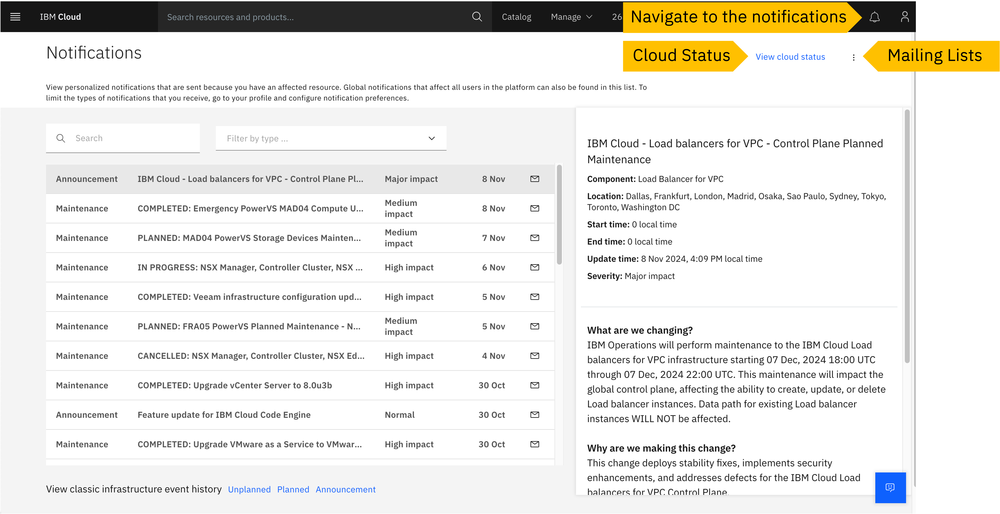

## 7.3 Kostenschätzungen
Der Cost Estimator ist ein integriertes Planungswerkzeug, mit dem Sie die monatlichen Kosten für Ihre geplante Infrastruktur prognostizieren können, bevor Sie Ressourcen bereitstellen. Er eignet sich ideal, um Budgets zu planen oder Genehmigungen einzuholen.

### So nutzen Sie das Tool:
### Im Katalog:
Wenn Sie einen Service konfigurieren, sehen Sie in der rechten Seitenleiste die aktuelle Preisschätzung. Anstatt direkt auf Create zu klicken, wählen Sie den Button `Add to estimate`. Dies fügt die Konfiguration Ihrem vorläufigen Warenkorb hinzu.

### Schätzung überprüfen:
Klicken Sie in der oberen Kopfzeile der Konsole auf das Taschenrechner-Symbol (Cost estimator). Hier sehen Sie die gesammelte Liste aller hinzugefügten Services.

### Funktionen in der Übersicht:
### Anpassung:
Sie können Mengen (z. B. Anzahl der Server oder GB Speicher) nachträglich ändern, um verschiedene Szenarien durchzuspielen.

### Währung:
Stellen Sie die Anzeige auf Ihre lokale Währung um.

### Export:
Über den Button Download CSV/XLSX oder Print/PDF können Sie einen offiziellen Kostenvoranschlag generieren, um diesen beispielsweise an die Finanzabteilung zur Freigabe weiterzuleiten.

## 7.3 Dokumentationen

Die [offizielle Dokumentation](https://cloud.ibm.com/docs) ist Ihre wichtigste Wissensquelle. Sie bietet technische Referenzen, die für den sicheren Betrieb unerlässlich sind.

### Wie Sie zur Dokumentation gelangen:
Sie haben zwei Wege, um auf die Inhalte zuzugreifen:

### Global:
Klicken Sie in der oberen Kopfzeile der Konsole auf den Eintrag `Docs` unter dem `? Symbol`. Dies führt Sie zur zentralen Startseite mit einer Suche über alle Dienste.

### Kontextbezogen:
 Wenn Sie sich gerade in der Konfiguration eines spezifischen Services (z. B. COS) befinden, klicken Sie im linken oder oberen Menü auf den Reiter `Docs`. Dies bringt Sie direkt zu den spezifischen Anleitungen für genau diesen Dienst.

### Warum Sie die Docs nutzen sollten:
### Schritt-für-Schritt-Tutorials:
Anstatt durch "Trial and Error" Zeit zu verlieren, finden Sie hier geprüfte Anleitungen ("Getting Started"), um Ressourcen korrekt und nach Best Practices aufzusetzen.

### API & CLI Referenzen:
Für Entwickler und Automatisierung sind hier alle Befehle, Endpunkte und SDKs dokumentiert, die Sie benötigen, um die Cloud programmatisch zu steuern.

### Troubleshooting:
Bevor Sie ein Support-Ticket eröffnen, finden Sie im Bereich "Troubleshooting" oft schnelle Lösungen für gängige Fehlermeldungen und Konfigurationsprobleme.

# 8. Best practices

| Typ | Beschreibung |
| :--- | :--- |
| Account Owner | Nutzen Sie den Owner-Login nur im Notfall. Erstellen Sie für die tägliche Verwaltung eine Platform Admin Gruppe |  
| IAM / Zugriff | Vermeiden Sie Einzel-Policies. Nutzen Sie konsequent Access Groups, um Berechtigungen zentral und skalierbar zu steuern |  
| Ressourcen | Trennen Sie Projekte und Umgebungen (Dev/Test/Prod) strikt durch eigene Ressourcengruppen für sauberes Billing und IA |
| Kosten| Richten Sie zwingend Spending Notifications ein, um bei Budgetüberschreitung sofort per E-Mail gewarnt zu werden |  
| Sicherheit | Nutzen Sie Context Based Restrictions (CBR), um den Zugriff nicht nur auf User, sondern auch auf sichere Netzwerke zu beschränken |
| Betrieb | Abonnieren Sie im Notification Center E-Mail-Warnungen für Incidents und Wartungsarbeiten |
| Support | Reagieren Sie zeitnah auf Rückfragen. Tickets werden nach 7 Tagen Inaktivität automatisch geschlossen | 
| Dokumentation | Konsultieren Sie die offiziellen Docs als primäre Quelle für Anleitungen und Troubleshooting, bevor Sie Tickets eröffnen |  
